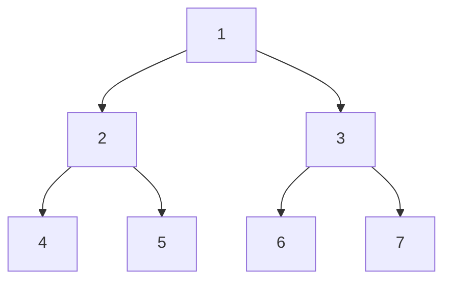
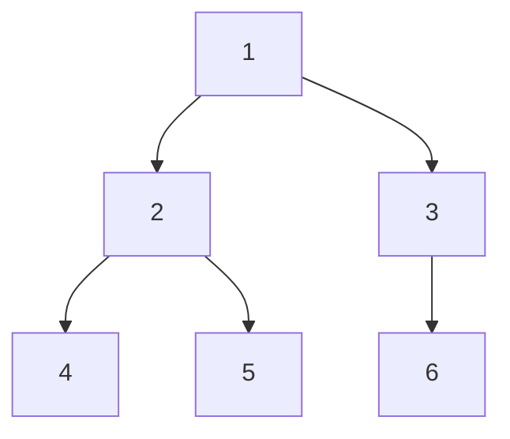
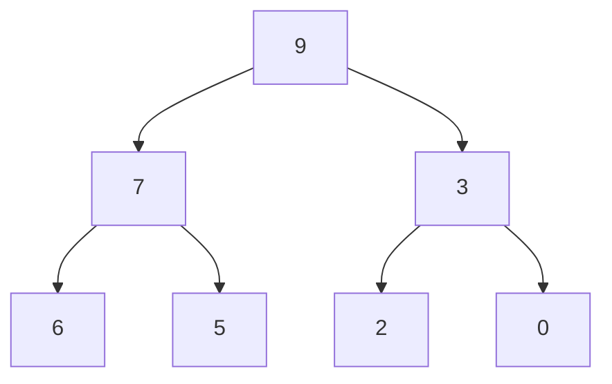

# 算法复杂度 

## 常数操作(固定时间)

执行时间固定的，跟数据量没有关系的，常见的算术运算：加，减，乘，除；常见的位运算；赋值、比较、自增、自减；数组寻址等都是常数操作。

## 非常数操作(非固定时间)

执行时间非固定，跟数据量有关的操作，都不是常数时间的操作，比如：链表寻址。

## 复杂度

时间复杂度：数据量为N的样本，执行完整个算法，N与常数操作的数量的关系

选择排序思想：以从小到大排序为例，每一轮以第1个未排序的数作为最小值，记下下标，和后面的值依次进行比较，若后面的值比最小值小，那么更新最小值的下标，直到这轮比较完，会找到一个最小值，然后将最小值和第一个数进行值交换。下一轮以第2个数为最小值的下标，进行比较。总共需要n-1轮比较。

第一轮比较需要进行n-1次比较常数操作和一次交换常数操作

第二轮比较需要进行n-2次比较常数操作和一次交换常数操作

.

.

.

第n-1轮比较需要进行1次比较常数操作和一次交换常数操作

根据等差数列求和可知整个流程需要Sn=na1+n(n-1)d/2次比较常数操作，和n次交换常数操作，将两部分加起来得到整个流程的所有常数操作和为：a*N^2+b*N+c（a、b、c为常数，也可以理解为a，b，c为固定时间的常数操作的耗时），复杂度则只看表达式最高阶项的部分，低阶项以及高阶项前面的系数都不要，所以这个算法的时间复杂度为：O(N^2)。复杂度是确定算法流程的总操作数量(常数操作)与样本数量之间的表达式关系。

```java
public static int[] select(int[] num) {
    int min;
    int temp;
    for (int i = 0; i < num.length - 1; i++) {
        min = i;
        for (int j = i; j < num.length; j++) {
            if (num[j] < num[min]) {
                min = j;
            }
        }

        if (min != i) {
            temp = num[min];
            num[min] = num[i];
            num[i] = temp;
        }
    }
    return num;
}
```

当流程是随着数据的变化而变化的，那必须要用最差的情况来估计流程。即O()表示的是最差情况下算法是几阶

比如利用插入排序对数组进行排序时

当数据为[1,2,3,4,5,6,7]这种情况时，时间复杂度为O(1)

当数据为[7,6,5,4,3,2,1]这种情况时，时间复杂度为O(N^2)

所以，插入 排序的时间复杂度为O(N^2)

```java
public static void insertionSort(int[] arr) {
    if (arr == null || arr.length < 2) {
        return;
    }
    // 不只1个数
    for (int i = 1; i < arr.length; i++) { // 0 ~ i 做到有序
        for (int j = i - 1; j >= 0 && arr[j] > arr[j + 1]; j--) {
            swap(arr, j, j + 1);
        }
    }
}
// i和j是一个位置的话，会出错
public static void swap(int[] arr, int i, int j) {
    arr[i] = arr[i] ^ arr[j];
    arr[j] = arr[i] ^ arr[j];
    arr[i] = arr[i] ^ arr[j];
}
```

# 数组和链表

## 数组

便于寻址，不便于增删数据(要维持数组在内存中的连续性)

## 链表

便于增删数据，不便于寻址

# 栈和队列

栈和队列是逻辑上的概念，用链表和数组都可以实现

## 栈

数据先进后出

## 队列

数据先进先出

# 哈希表和有序表

## 哈希表

增、删、查、改时间复杂度都是O(1)，只是这个常数操作的耗时会有点长； 当哈希表中的K,V是基本类型时，哈希表存储的是该基础类型的实际值，而当K,V是非基本类型的时候，哈希表存储的是对象的引用

## 有序表

比如 TreeMap；实现方式有：红黑树、avl、sb树、跳表；增删改查的时间复杂度为O(logN)

有序表的key必须为可比较的对象，并且有序表不会重复添加两个相等的key

```java
public class CustomComparator {

    public static class Student {
        public String name;
        public int id;
        public int age;

        public Student(String name, int id, int age) {
            this.name = name;
            this.id = id;
            this.age = age;
        }
    }

    public static class IdAscendingComparator implements Comparator<Student> {

        // 返回负数的时候，第一个参数排在前面
        // 返回正数的时候，第二个参数排在前面
        // 返回0的时候，谁在前面无所谓
        @Override
        public int compare(Student o1, Student o2) {
            return o1.id - o2.id;
        }

    }

    public static void main(String[] args) {

        Student student1 = new Student("A", 4, 40);
        Student student2 = new Student("B", 4, 21);
        Student student3 = new Student("C", 5, 12);
        Student student4 = new Student("D", 6, 62);
        Student student5 = new Student("E", 7, 42);
        TreeMap<Student, String> treeMap = new TreeMap<>((a, b) -> (a.id - b.id));
        treeMap.put(student1, "我是学生1，我的名字叫A");
        treeMap.put(student2, "我是学生2，我的名字叫B");
        treeMap.put(student3, "我是学生3，我的名字叫C");
        treeMap.put(student4, "我是学生4，我的名字叫D");
        treeMap.put(student5, "我是学生5，我的名字叫E");
        for (Student s : treeMap.keySet()) {
            System.out.println(s.name + "," + s.id + "," + s.age);
        }

    }
}
```


# 递归

## Master公式

形如：T(N)=a*T(N/b) + O(N^d) 的递归函数，即：子问题规模一致的递归可以直接通过Master公式来确定时间复杂度

如果log(b,a) < d，复杂度为O(N^d) 即：N的d次方

如果log(b,a) > d，复杂度为O(N^log(b,a)) 即：N的log(b,a)次方

如果log(b,a) == d，复杂度为O(N^d * logN) 即：N的d次方乘以log(2,N)

其中的a、b、d都是常数

### 实验1

比如通过递归求arr[L......R]范围中的最大值，相当于将问题分解为分别求0 ~ N/2中的最大值和N/2+1 ~ N-1中的最大值，然后再求这两个值的最大值(两个数求最大值的时间复杂度为O(1))，即T(N) = 2  * T(N / 2) + O (N^0) ，可以得到a=2，b=2，d=0，再通过master公式：因为log(2,2)>0，所以时间复杂度等于O(N^log(2,2))，即：O(N^1)，即：O(N)

```java
// 求arr中的最大值
public static int getMax(int[] arr) {
    return process(arr, 0, arr.length - 1);
}

// arr[L..R]范围上求最大值  L ... R   N
public static int process(int[] arr, int L, int R) {
    // arr[L..R]范围上只有一个数，直接返回，base case
    if (L == R) { 
        return arr[L];
    }
    // L...R 不只一个数
    // mid = (L + R) / 2
    int mid = L + ((R - L) >> 1); // 中点   	1
    int leftMax = process(arr, L, mid);
    int rightMax = process(arr, mid + 1, R);
    return Math.max(leftMax, rightMax);
}
```

### 实验2

比如归并排序：首先将数据集分为相等的2个子集，然后用递归的方式让两个子集分别有序，最后让左右两个子集合并且有序，如果可以使合并排序的算法做到时间复杂度为O(N)的话，那么：T(N) = 2  * T(N / 2) + O (N^1)，可以得到a=2，b=2，d=1，再通过master公式：因为log(2,2)==1，所以时间复杂度等于O(N^d * logN)，即：O(N*logN)

```java
public class MergeSort {

	// 递归方法实现
	public static void mergeSort1(int[] arr) {
		if (arr == null || arr.length < 2) {
			return;
		}
		process(arr, 0, arr.length - 1);
	}

	// 请把arr[L..R]排有序
	// l...r N
	// T(N) = 2 * T(N / 2) + O(N)
	// O(N * logN)
	public static void process(int[] arr, int L, int R) {
		if (L == R) { // base case
			return;
		}
		int mid = L + ((R - L) >> 1);
		process(arr, L, mid);
		process(arr, mid + 1, R);
		merge(arr, L, mid, R);
	}

	public static void merge(int[] arr, int L, int M, int R) {
		int[] help = new int[R - L + 1];
		int i = 0;
		int p1 = L;
		int p2 = M + 1;
		while (p1 <= M && p2 <= R) {
			help[i++] = arr[p1] <= arr[p2] ? arr[p1++] : arr[p2++];
		}
		// 要么p1越界了，要么p2越界了
		while (p1 <= M) {
			help[i++] = arr[p1++];
		}
		while (p2 <= R) {
			help[i++] = arr[p2++];
		}
		for (i = 0; i < help.length; i++) {
			arr[L + i] = help[i];
		}
	}
}
```

### 实验3

快速排序

```java
public class PartitionAndQuickSort {

    public static void swap(int[] arr, int i, int j) {
        int tmp = arr[i];
        arr[i] = arr[j];
        arr[j] = tmp;
    }

    // arr[L..R]上，以arr[R]位置的数做划分值
    // 小于等于arr[R]的放左边，大于arr[R]的放右边，并且arr[R]放在小于等于区域的最右边
    public static int partition(int[] arr, int L, int R) {
        if (L > R) {
            return -1;
        }
        if (L == R) {
            return L;
        }
        int lessEqual = L - 1;
        int index = L;
        while (index < R) {
            if (arr[index] <= arr[R]) {
                swap(arr, index, ++lessEqual);
            }
            index++;
        }
        swap(arr, ++lessEqual, R);
        return lessEqual;
    }

    // arr[L...R] 玩荷兰国旗问题的划分，以arr[R]做划分值
    // <arr[R] ==arr[R] > arr[R]
    public static int[] netherlandsFlag(int[] arr, int L, int R) {
        if (L > R) { // L...R L>R
            return new int[]{-1, -1};
        }
        if (L == R) {
            return new int[]{L, R};
        }
        int less = L - 1; // < 区 右边界
        int more = R; // > 区 左边界
        int index = L;
        while (index < more) { // 当前位置，不能和 >区的左边界撞上
            if (arr[index] == arr[R]) {
                index++;
            } else if (arr[index] < arr[R]) {
//				swap(arr, less + 1, index);
//				less++;
//				index++;						
                swap(arr, index++, ++less);
            } else { // >
                swap(arr, index, --more);
            }
        }
        swap(arr, more, R); // <[R]   =[R]   >[R]
        return new int[]{less + 1, more};
    }

    /**
     * 快排1和快排2的时间复杂都为O(N^2)
     * 最差的情况是为类似这样的数组排序：[1,2,3,4,5,6,7]，并且以最后一个数作为比较数
     * 第一次partition的时候会比较6个数，第二次partition比较5个数，因此整个算法的常数操作和为一个等差数列，
     *
     * @param arr
     */
    public static void quickSort1(int[] arr) {
        if (arr == null || arr.length < 2) {
            return;
        }
        process1(arr, 0, arr.length - 1);
    }

    public static void process1(int[] arr, int L, int R) {
        if (L >= R) {
            return;
        }
        // L..R partition arr[R] [ <=arr[R] arr[R] >arr[R] ]
        int M = partition(arr, L, R);
        process1(arr, L, M - 1);
        process1(arr, M + 1, R);
    }

    public static void quickSort2(int[] arr) {
        if (arr == null || arr.length < 2) {
            return;
        }
        process2(arr, 0, arr.length - 1);
    }

    // arr[L...R] 排有序，快排2.0方式
    public static void process2(int[] arr, int L, int R) {
        if (L >= R) {
            return;
        }
        // [ equalArea[0]  ,  equalArea[0]]
        int[] equalArea = netherlandsFlag(arr, L, R);
        process2(arr, L, equalArea[0] - 1);
        process2(arr, equalArea[1] + 1, R);
    }

    /**
     * 快排3的时间复杂度能做到O(N*logN)，原因如下：
     * 1.通过快排为类似这样的数组：[1,2,3,7,5,6,4]进行排序时，时间复杂度最低，因为第一次partition的时间复杂度为O(N)
     * 然后2个子集分别为[1,2,3]、[5,6,7]，即：N/2；那么：T(N) = 2  * T(N / 2) + O (N^1)；根据Master公式可以得到时间复杂度为：O(N*logN)；
     * 2.通过快排为类似这样的数组：[1,2,3,4,5,6,7]进行排序时，时间复杂度最高：O(N^2)；
     * 通过数学证明，通过随机数的方式选择比较数，可以使选择到最佳比较数概率趋近100%，因此快排3的时间复杂度为：O(N*logN)
     *
     * @param arr
     */
    public static void quickSort3(int[] arr) {
        if (arr == null || arr.length < 2) {
            return;
        }
        process3(arr, 0, arr.length - 1);
    }

    public static void process3(int[] arr, int L, int R) {
        if (L >= R) {
            return;
        }
        // 随机选取数组中某个下标的值和最右边的值进行交换
        swap(arr, L + (int) (Math.random() * (R - L + 1)), R);
        int[] equalArea = netherlandsFlag(arr, L, R);
        process3(arr, L, equalArea[0] - 1);
        process3(arr, equalArea[1] + 1, R);
    }

    // 快排非递归版本需要的辅助类
    // 要处理的是什么范围上的排序
    public static class Op {
        public int l;
        public int r;

        public Op(int left, int right) {
            l = left;
            r = right;
        }
    }

    // 快排3.0 非递归版本
    public static void quickSort4(int[] arr) {
        if (arr == null || arr.length < 2) {
            return;
        }
        int N = arr.length;
        swap(arr, (int) (Math.random() * N), N - 1);
        int[] equalArea = netherlandsFlag(arr, 0, N - 1);
        int el = equalArea[0];
        int er = equalArea[1];
        Stack<Op> stack = new Stack<>();
        stack.push(new Op(0, el - 1));
        stack.push(new Op(er + 1, N - 1));
        while (!stack.isEmpty()) {
            Op op = stack.pop(); // op.l  ... op.r
            if (op.l < op.r) {
                swap(arr, op.l + (int) (Math.random() * (op.r - op.l + 1)), op.r);
                equalArea = netherlandsFlag(arr, op.l, op.r);
                el = equalArea[0];
                er = equalArea[1];
                stack.push(new Op(op.l, el - 1));
                stack.push(new Op(er + 1, op.r));
            }
        }
    }

    // for test
    public static int[] generateRandomArray(int maxSize, int maxValue) {
        int[] arr = new int[(int) ((maxSize + 1) * Math.random())];
        for (int i = 0; i < arr.length; i++) {
            arr[i] = (int) ((maxValue + 1) * Math.random()) - (int) (maxValue * Math.random());
        }
        return arr;
    }

    // for test
    public static int[] copyArray(int[] arr) {
        if (arr == null) {
            return null;
        }
        int[] res = new int[arr.length];
        for (int i = 0; i < arr.length; i++) {
            res[i] = arr[i];
        }
        return res;
    }

    // for test
    public static boolean isEqual(int[] arr1, int[] arr2) {
        if ((arr1 == null && arr2 != null) || (arr1 != null && arr2 == null)) {
            return false;
        }
        if (arr1 == null && arr2 == null) {
            return true;
        }
        if (arr1.length != arr2.length) {
            return false;
        }
        for (int i = 0; i < arr1.length; i++) {
            if (arr1[i] != arr2[i]) {
                return false;
            }
        }
        return true;
    }

    // for test
    public static void printArray(int[] arr) {
        if (arr == null) {
            return;
        }
        for (int i = 0; i < arr.length; i++) {
            System.out.print(arr[i] + " ");
        }
        System.out.println();
    }

    // for test
    public static void main(String[] args) {
        int testTime = 500000;
        int maxSize = 100;
        int maxValue = 100;
        boolean succeed = true;
        for (int i = 0; i < testTime; i++) {
            int[] arr1 = generateRandomArray(maxSize, maxValue);
            int[] arr2 = copyArray(arr1);
            int[] arr3 = copyArray(arr1);
            int[] arr4 = copyArray(arr1);
            quickSort1(arr1);
            quickSort2(arr2);
            quickSort3(arr3);
            quickSort4(arr4);
            if (!isEqual(arr1, arr2) || !isEqual(arr2, arr3) || !isEqual(arr3, arr4)) {
                succeed = false;
                break;
            }
        }
        System.out.println(succeed ? "Nice!" : "Oops!");
    }
}
```

# 堆

堆使用层次的名字叫优先级队列(PQ)，在介绍堆之前得先了解完全二叉树：一棵深度为k的有n个结点的二叉树，对树中的结点按从上至下、从左到右的顺序进行编号，如果编号为i（1≤i≤n）的结点与满二叉树中编号为i的结点在二叉树中的位置相同，则这棵二叉树称为完全二叉树。

### 二叉树

1. 二叉树中，第 i 层最多有2^i-1个节点，
2. 如果二叉树的深度为K，那么此二叉树最多有 2^K-1个结点。
3. 二叉树中，终端结点数（叶子结点数）为 n0，度为2的结点数为n2，则 n0=n2+1。

性质 3 的计算方法为：对于一个二叉树来说，除了度为 0 的叶子结点和度为 2 的结点，剩下的就是度为 1 的结点（设为 n1），那么总结点 n=n0+n1+n2。同时，对于每一个结点来说都是由其父结点分支表示的，假设树中分枝数为 B，那么总结点数 n=B+1。而分枝数是可以通过 n1 和 n2 表示的，即 B=n1+2*n2。所以，n 用另外一种方式表示为 n=n1+2*n2+1。两种方式得到的 n 值组成一个方程组，就可以得出 n0=n2+1。

简单地理解，满足以下两个条件的树就是二叉树：

1. 本身是有序树；
2. 树中包含的各个节点的度不能超过 2，即只能是 0、1 或者 2；

### 满二叉树

如果二叉树中除了叶子结点，每个结点的度都为 2，则此二叉树称为满二叉树。



满二叉树除了满足普通二叉树的性质，还具有以下性质：

1. 满二叉树中第 i 层的节点数为 2n-1 个
2. 深度为 k 的满二叉树必有 2k-1 个节点 ，叶子数为 2k-1。
3. 满二叉树中不存在度为 1 的节点，每一个分支点中都两棵深度相同的子树，且叶子节点都在最底层。
4. 具有 n 个节点的满二叉树的深度为 log2(n+1)。

### 完全二叉树

如果二叉树中除去最后一层节点为满二叉树，且最后一层的结点依次从左到右分布，则此二叉树被称为完全二叉树。



完全二叉树除了具有普通二叉树的性质，如果将含有n个结点的完全二叉树按照层次从左到右依次标号，以下几个结论成立：

1. n个结点的完全二叉树的深度为⌊log2n⌋+1。⌊log2n⌋表示取小于log2n的最大整数。例如，⌊log24⌋=2，而⌊log25⌋结果也是2。
2. 当 i>1 时，父亲结点为结点 [i/2] 。（i=1 时，表示的是根结点，无父亲结点）
3. 如果 2*i>n（总结点的个数） ，则结点 i 肯定没有左孩子（为叶子结点）；否则其左孩子是结点 2*i 。
4. 如果 2*i+1>n ，则结点 i 肯定没有右孩子；否则右孩子是结点 2*i+1 。

### 堆的定义

堆结构就是用数组实现的完全二叉树结构，堆可以追加重复值（有序表不能有重复值）

1. 完全二叉树中如果每棵子树的最大值都在顶部就是大根堆；
2. 完全二叉树中如果每棵子树的最小值都在顶部就是小根堆；
3. 堆结构的heapInsert与heapify操作；
4. 堆结构的增大和减少；
5. 优先级队列结构，就是堆结构。

#### 大根堆

每个子树，根节点是整个子树中最大的数据，每个节点的数据都比其子节点大。



#### 小根堆

每个子树，根节点是整个子树中最小的数据，每个节点的数据都比其子节点小。


```java
import java.util.Comparator;
import java.util.PriorityQueue;

public class HeapDef {

    /**
     * 堆结构就是用数组实现的完全二叉树结构
     */
    public static class MyMaxHeap {
        private int[] heap;
        private final int limit;
        private int heapSize;

        public MyMaxHeap(int limit) {
            heap = new int[limit];
            this.limit = limit;
            heapSize = 0;
        }

        public boolean isEmpty() {
            return heapSize == 0;
        }

        public boolean isFull() {
            return heapSize == limit;
        }

        // 时间复杂度：O(logN)
        public void push(int value) {
            if (heapSize == limit) {
                throw new RuntimeException("heap is full");
            }
            heap[heapSize] = value;
            // value  heapSize
            heapInsert(heap, heapSize++);
        }

        // 返回最大值，并且在大根堆中，把最大值删掉，剩下的数，依然保持大根堆组织
        // 时间复杂度：O(logN)
        public int pop() {
            // 返回值为根节点
            int ans = heap[0];
            // 将根节点跟堆中最后一个节点交互，并且将heapSize减一
            // 原来的根节点仍然留在数组中，只是将它放在堆的末尾，不会参与接下来的重新调整堆结构的运算，并且在之后有新的数据插入堆中的时候会被覆盖
            swap(heap, 0, --heapSize);
            // 通过heapify函数调整堆结构，使其仍然保持大根堆结构
            heapify(heap, 0, heapSize);
            return ans;
        }

        // 新加进来的数，现在停在了index位置，请依次往上移动，(index - 1)/2为父节点在数组中的位置
        // 移动到0位置，或者干不掉自己的父亲了，停！
        private void heapInsert(int[] arr, int index) {
            // 循环终止的条件1：arr[index]<=arr[(index - 1)/2])
            // 循环终止的条件2：当新插入的节点大于所以父节点，来到了index==0，那么(0-1)/2的结果取整后为0，而arr[0]==arr[0]，所以循环同样终止
            while (arr[index] > arr[(index - 1) / 2]) {
                swap(arr, index, (index - 1) / 2);
                index = (index - 1) / 2;
            }
        }

        // 从index位置，往下看，不断的下沉
        // 停：较大的孩子都不再比index位置的数大；已经没孩子了
        private void heapify(int[] arr, int index, int heapSize) {
            int left = index * 2 + 1;
            while (left < heapSize) { // 如果有左孩子，有没有右孩子，可能有可能没有！
                // 把较大孩子的下标，给largest
                int largest = left + 1 < heapSize && arr[left + 1] > arr[left] ? left + 1 : left;
                largest = arr[largest] > arr[index] ? largest : index;
                if (largest == index) {
                    break;
                }
                // index和较大孩子，要互换
                swap(arr, largest, index);
                index = largest;
                left = index * 2 + 1;
            }
        }

        private void swap(int[] arr, int i, int j) {
            int tmp = arr[i];
            arr[i] = arr[j];
            arr[j] = tmp;
        }

    }

    public static class RightMaxHeap {
        private int[] arr;
        private final int limit;
        private int size;

        public RightMaxHeap(int limit) {
            arr = new int[limit];
            this.limit = limit;
            size = 0;
        }

        public boolean isEmpty() {
            return size == 0;
        }

        public boolean isFull() {
            return size == limit;
        }

        public void push(int value) {
            if (size == limit) {
                throw new RuntimeException("heap is full");
            }
            arr[size++] = value;
        }

        public int pop() {
            int maxIndex = 0;
            for (int i = 1; i < size; i++) {
                if (arr[i] > arr[maxIndex]) {
                    maxIndex = i;
                }
            }
            int ans = arr[maxIndex];
            arr[maxIndex] = arr[--size];
            return ans;
        }

    }


    public static class MyComparator implements Comparator<Integer> {

        @Override
        public int compare(Integer o1, Integer o2) {
            return o2 - o1;
        }

    }

    public static void main(String[] args) {

        // JDK的优先级队列就是堆结构，默认：小根堆
        PriorityQueue<Integer> heap = new PriorityQueue<>();
        heap.add(6);
        heap.add(8);
        heap.add(0);
        heap.add(2);
        heap.add(9);
        heap.add(1);

        while (!heap.isEmpty()) {
            System.out.println(heap.poll());
        }

        // 通过自定义比较器，可以构建大根堆
        PriorityQueue<Integer> heap1 = new PriorityQueue<>(new MyComparator());
		heap1.add(5);
		heap1.add(5);
		heap1.add(5);
		heap1.add(3);
        System.out.println(heap1.peek());
        // 堆中可以追加重复数据，而有序表则不行。
		heap1.add(7);
		heap1.add(0);
		heap1.add(7);
		heap1.add(0);
        System.out.println(heap1.peek());
        while (!heap1.isEmpty()) {
            System.out.println(heap1.poll());
        }
        int value = 1000;
        int limit = 100;
        int testTimes = 1000000;
        for (int i = 0; i < testTimes; i++) {
            int curLimit = (int) (Math.random() * limit) + 1;
            MyMaxHeap my = new MyMaxHeap(curLimit);
            RightMaxHeap test = new RightMaxHeap(curLimit);
            int curOpTimes = (int) (Math.random() * limit);
            for (int j = 0; j < curOpTimes; j++) {
                if (my.isEmpty() != test.isEmpty()) {
                    System.out.println("Oops!");
                }
                if (my.isFull() != test.isFull()) {
                    System.out.println("Oops!");
                }
                if (my.isEmpty()) {
                    int curValue = (int) (Math.random() * value);
                    my.push(curValue);
                    test.push(curValue);
                } else if (my.isFull()) {
                    if (my.pop() != test.pop()) {
                        System.out.println("Oops!");
                    }
                } else {
                    if (Math.random() < 0.5) {
                        int curValue = (int) (Math.random() * value);
                        my.push(curValue);
                        test.push(curValue);
                    } else {
                        if (my.pop() != test.pop()) {
                            System.out.println("Oops!");
                        }
                    }
                }
            }
        }
        System.out.println("finish!");
    }
}
```

#### 堆排序

```java
import java.util.Arrays;

/**
 * 利用堆的特点，对数组进行排序
 */
public class HeapSort {

    // 堆排序的时间复杂度：O(N*logN)；额外空间复杂度O(1)
    public static void heapSort(int[] arr) {

        if (arr == null || arr.length < 2) {
            return;
        }
//        // 首先将数据调整成大根堆，有两种方式：
//        // 第一种，从头遍历整个数组，将每个数作为新插入的值并通过heapInsert方法跟父节点进行比较，如果值大于父节点的值就进行交换。
//        // 时间复杂度： O(N*logN)
//        for (int i = 0; i < arr.length; i++) { // O(N)
//            heapInsert(arr, i); // O(logN)
//        }
        // 第二种，从底部遍历整个数组，
        // 时间复杂度：O(N)
        for (int i = arr.length - 1; i >= 0; i--) {
            heapify(arr, i, arr.length);
        }
        // 第一次完成大根堆的创建后，堆大小为数组的大小。
        int heapSize = arr.length;
        // 全局最大值调整到数组的末尾，并且将堆大小减一，
        // 将堆大小减一的原因是：全局最大值已经确定并且放在正确的位置，即：数组的末尾；那么它将不会在参与接下来的运算。
        // 接下来将对剩下的heapSize-1的数重新构建大根堆，然后找到全局第二大的值，一直这样循环下去，直到heapSize等于0为止、
        // 时间复杂度：O(N*logN)
        swap(arr, 0, --heapSize);
        while (heapSize > 0) { // O(N)
            heapify(arr, 0, heapSize); // O(logN)
            swap(arr, 0, --heapSize); // O(1)
        }
        // 第一次建立大根堆的时间复杂度为：O(N*logN)或者O(N)，
        // 之后循环构建大根堆的时间复杂度是：O(N*logN)，
        // 取最高阶所以堆排序的时间复杂度还是：O(N*logN)
    }

    // arr[index]刚来的数，往上
    public static void heapInsert(int[] arr, int index) {
        while (arr[index] > arr[(index - 1) / 2]) {
            swap(arr, index, (index - 1) / 2);
            index = (index - 1) / 2;
        }
    }

    // arr[index]位置的数，能否往下移动
    public static void heapify(int[] arr, int index, int heapSize) {
        int left = index * 2 + 1; // 左孩子的下标
        while (left < heapSize) { // 下方还有孩子的时候
            // 两个孩子中，谁的值大，把下标给largest
            // 1）只有左孩子，left -> largest
            // 2) 同时有左孩子和右孩子，右孩子的值<= 左孩子的值，left -> largest
            // 3) 同时有左孩子和右孩子并且右孩子的值> 左孩子的值， right -> largest
            int largest = left + 1 < heapSize && arr[left + 1] > arr[left] ? left + 1 : left;
            // 父和较大的孩子之间，谁的值大，把下标给largest
            largest = arr[largest] > arr[index] ? largest : index;
            if (largest == index) {
                break;
            }
            swap(arr, largest, index);
            index = largest;
            left = index * 2 + 1;
        }
    }

    public static void swap(int[] arr, int i, int j) {
        int tmp = arr[i];
        arr[i] = arr[j];
        arr[j] = tmp;
    }

    // for test
    public static void comparator(int[] arr) {
        Arrays.sort(arr);
    }

    // for test
    public static int[] generateRandomArray(int maxSize, int maxValue) {
        int[] arr = new int[(int) ((maxSize + 1) * Math.random())];
        for (int i = 0; i < arr.length; i++) {
            arr[i] = (int) ((maxValue + 1) * Math.random()) - (int) (maxValue * Math.random());
        }
        return arr;
    }

    // for test
    public static int[] copyArray(int[] arr) {
        if (arr == null) {
            return null;
        }
        int[] res = new int[arr.length];
        for (int i = 0; i < arr.length; i++) {
            res[i] = arr[i];
        }
        return res;
    }

    // for test
    public static boolean isEqual(int[] arr1, int[] arr2) {
        if ((arr1 == null && arr2 != null) || (arr1 != null && arr2 == null)) {
            return false;
        }
        if (arr1 == null && arr2 == null) {
            return true;
        }
        if (arr1.length != arr2.length) {
            return false;
        }
        for (int i = 0; i < arr1.length; i++) {
            if (arr1[i] != arr2[i]) {
                return false;
            }
        }
        return true;
    }

    // for test
    public static void printArray(int[] arr) {
        if (arr == null) {
            return;
        }
        for (int i = 0; i < arr.length; i++) {
            System.out.print(arr[i] + " ");
        }
        System.out.println();
    }

    // for test
    public static void main(String[] args) {

        int testTime = 500000;
        int maxSize = 100;
        int maxValue = 100;
        boolean succeed = true;
        for (int i = 0; i < testTime; i++) {
            int[] arr1 = generateRandomArray(maxSize, maxValue);
            int[] arr2 = copyArray(arr1);
            heapSort(arr1);
            comparator(arr2);
            if (!isEqual(arr1, arr2)) {
                succeed = false;
                break;
            }
        }
        System.out.println(succeed ? "Nice!" : "Fucking fucked!");

        int[] arr = generateRandomArray(maxSize, maxValue);
        printArray(arr);
        heapSort(arr);
        printArray(arr);
    }

}
```

