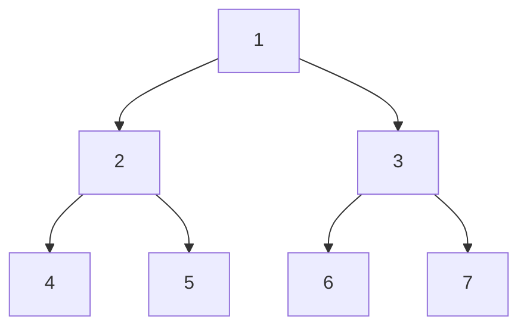
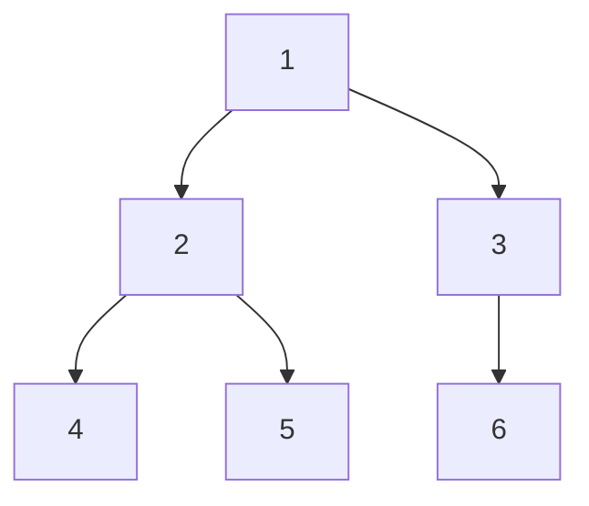
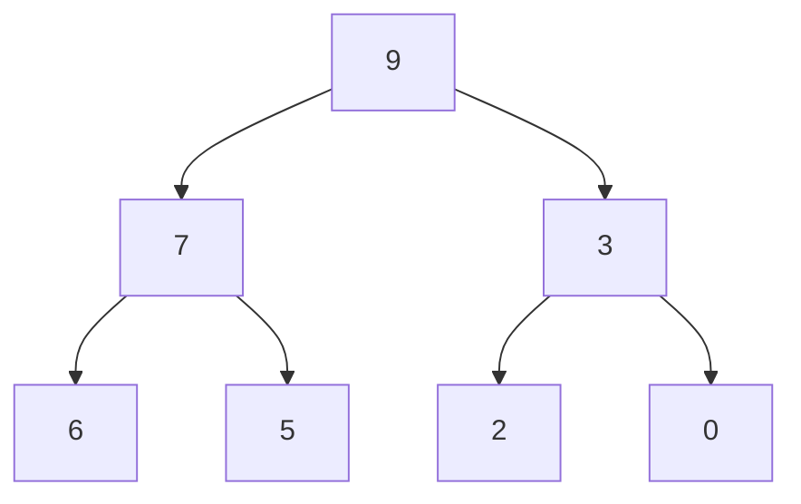
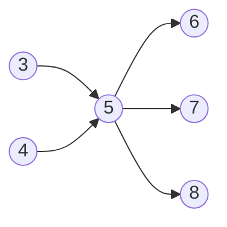

# 算法复杂度 

## 常数操作(固定时间)

执行时间固定的，跟数据量没有关系的，常见的算术运算：加，减，乘，除；常见的位运算；赋值、比较、自增、自减；数组寻址等都是常数操作。

## 非常数操作(非固定时间)

执行时间非固定，跟数据量有关的操作，都不是常数时间的操作，比如：链表寻址。

## 复杂度

时间复杂度：数据量为N的样本，执行完整个算法，N与常数操作的数量的关系

选择排序思想：以从小到大排序为例，每一轮以第1个未排序的数作为最小值，记下下标，和后面的值依次进行比较，若后面的值比最小值小，那么更新最小值的下标，直到这轮比较完，会找到一个最小值，然后将最小值和第一个数进行值交换。下一轮以第2个数为最小值的下标，进行比较。总共需要n-1轮比较。

第一轮比较需要进行n-1次比较常数操作和一次交换常数操作

第二轮比较需要进行n-2次比较常数操作和一次交换常数操作

.

.

.

第n-1轮比较需要进行1次比较常数操作和一次交换常数操作

根据等差数列求和可知整个流程需要Sn=na1+n(n-1)d/2次比较常数操作，和n次交换常数操作，将两部分加起来得到整个流程的所有常数操作和为：a*N^2+b*N+c（a、b、c为常数，也可以理解为a，b，c为固定时间的常数操作的耗时），复杂度则只看表达式最高阶项的部分，低阶项以及高阶项前面的系数都不要，所以这个算法的时间复杂度为：O(N^2)。复杂度是确定算法流程的总操作数量(常数操作)与样本数量之间的表达式关系。

```java
public static int[] select(int[] num) {
    int min;
    int temp;
    for (int i = 0; i < num.length - 1; i++) {
        min = i;
        for (int j = i; j < num.length; j++) {
            if (num[j] < num[min]) {
                min = j;
            }
        }

        if (min != i) {
            temp = num[min];
            num[min] = num[i];
            num[i] = temp;
        }
    }
    return num;
}
```

当流程是随着数据的变化而变化的，那必须要用最差的情况来估计流程。即O()表示的是最差情况下算法是几阶

比如利用插入排序对数组进行排序时

当数据为[1,2,3,4,5,6,7]这种情况时，时间复杂度为O(1)

当数据为[7,6,5,4,3,2,1]这种情况时，时间复杂度为O(N^2)

所以，插入 排序的时间复杂度为O(N^2)

```java
public static void insertionSort(int[] arr) {
    if (arr == null || arr.length < 2) {
        return;
    }
    // 不只1个数
    for (int i = 1; i < arr.length; i++) { // 0 ~ i 做到有序
        for (int j = i - 1; j >= 0 && arr[j] > arr[j + 1]; j--) {
            swap(arr, j, j + 1);
        }
    }
}
// i和j是一个位置的话，会出错
public static void swap(int[] arr, int i, int j) {
    arr[i] = arr[i] ^ arr[j];
    arr[j] = arr[i] ^ arr[j];
    arr[i] = arr[i] ^ arr[j];
}
```

# 数组和链表

## 数组

便于寻址，不便于增删数据(要维持数组在内存中的连续性)

## 链表

便于增删数据，不便于寻址

# 栈和队列

栈和队列是逻辑上的概念，用链表和数组都可以实现

## 栈

数据先进后出

## 队列

数据先进先出

# 哈希表和有序表

## 哈希表

增、删、查、改时间复杂度都是O(1)，只是这个常数操作的耗时会有点长； 当哈希表中的K,V是基本类型时，哈希表存储的是该基础类型的实际值，而当K,V是非基本类型的时候，哈希表存储的是对象的引用

## 有序表

比如 TreeMap；实现方式有：红黑树、avl、sb树、跳表；增删改查的时间复杂度为O(logN)

有序表的key必须为可比较的对象，并且有序表不会重复添加两个相等的key

```java
public class CustomComparator {

    public static class Student {
        public String name;
        public int id;
        public int age;

        public Student(String name, int id, int age) {
            this.name = name;
            this.id = id;
            this.age = age;
        }
    }

    public static class IdAscendingComparator implements Comparator<Student> {

        // 返回负数的时候，第一个参数排在前面
        // 返回正数的时候，第二个参数排在前面
        // 返回0的时候，谁在前面无所谓
        @Override
        public int compare(Student o1, Student o2) {
            return o1.id - o2.id;
        }

    }

    public static void main(String[] args) {

        Student student1 = new Student("A", 4, 40);
        Student student2 = new Student("B", 4, 21);
        Student student3 = new Student("C", 5, 12);
        Student student4 = new Student("D", 6, 62);
        Student student5 = new Student("E", 7, 42);
        TreeMap<Student, String> treeMap = new TreeMap<>((a, b) -> (a.id - b.id));
        treeMap.put(student1, "我是学生1，我的名字叫A");
        treeMap.put(student2, "我是学生2，我的名字叫B");
        treeMap.put(student3, "我是学生3，我的名字叫C");
        treeMap.put(student4, "我是学生4，我的名字叫D");
        treeMap.put(student5, "我是学生5，我的名字叫E");
        for (Student s : treeMap.keySet()) {
            System.out.println(s.name + "," + s.id + "," + s.age);
        }

    }
}
```


# 递归

## Master公式

形如：T(N)=a*T(N/b) + O(N^d) 的递归函数，即：子问题规模一致的递归可以直接通过Master公式来确定时间复杂度

如果log(b,a) < d，复杂度为O(N^d) 即：N的d次方

如果log(b,a) > d，复杂度为O(N^log(b,a)) 即：N的log(b,a)次方

如果log(b,a) == d，复杂度为O(N^d * logN) 即：N的d次方乘以log(2,N)

其中的a、b、d都是常数

### 实验1

比如通过递归求arr[L......R]范围中的最大值，相当于将问题分解为分别求0 ~ N/2中的最大值和N/2+1 ~ N-1中的最大值，然后再求这两个值的最大值(两个数求最大值的时间复杂度为O(1))，即T(N) = 2  * T(N / 2) + O (N^0) ，可以得到a=2，b=2，d=0，再通过master公式：因为log(2,2)>0，所以时间复杂度等于O(N^log(2,2))，即：O(N^1)，即：O(N)

```java
// 求arr中的最大值
public static int getMax(int[] arr) {
    return process(arr, 0, arr.length - 1);
}

// arr[L..R]范围上求最大值  L ... R   N
public static int process(int[] arr, int L, int R) {
    // arr[L..R]范围上只有一个数，直接返回，base case
    if (L == R) { 
        return arr[L];
    }
    // L...R 不只一个数
    // mid = (L + R) / 2
    int mid = L + ((R - L) >> 1); // 中点   	1
    int leftMax = process(arr, L, mid);
    int rightMax = process(arr, mid + 1, R);
    return Math.max(leftMax, rightMax);
}
```

### 实验2

比如归并排序：首先将数据集分为相等的2个子集，然后用递归的方式让两个子集分别有序，最后让左右两个子集合并且有序，如果可以使合并排序的算法做到时间复杂度为O(N)的话，那么：T(N) = 2  * T(N / 2) + O (N^1)，可以得到a=2，b=2，d=1，再通过master公式：因为log(2,2)==1，所以时间复杂度等于O(N^d * logN)，即：O(N*logN)

```java
public class MergeSort {

	// 递归方法实现
	public static void mergeSort1(int[] arr) {
		if (arr == null || arr.length < 2) {
			return;
		}
		process(arr, 0, arr.length - 1);
	}

	// 请把arr[L..R]排有序
	// l...r N
	// T(N) = 2 * T(N / 2) + O(N)
	// O(N * logN)
	public static void process(int[] arr, int L, int R) {
		if (L == R) { // base case
			return;
		}
		int mid = L + ((R - L) >> 1);
		process(arr, L, mid);
		process(arr, mid + 1, R);
		merge(arr, L, mid, R);
	}

	public static void merge(int[] arr, int L, int M, int R) {
		int[] help = new int[R - L + 1];
		int i = 0;
		int p1 = L;
		int p2 = M + 1;
		while (p1 <= M && p2 <= R) {
			help[i++] = arr[p1] <= arr[p2] ? arr[p1++] : arr[p2++];
		}
		// 要么p1越界了，要么p2越界了
		while (p1 <= M) {
			help[i++] = arr[p1++];
		}
		while (p2 <= R) {
			help[i++] = arr[p2++];
		}
		for (i = 0; i < help.length; i++) {
			arr[L + i] = help[i];
		}
	}
}
```

### 实验3

快速排序

```java
public class PartitionAndQuickSort {

    public static void swap(int[] arr, int i, int j) {
        int tmp = arr[i];
        arr[i] = arr[j];
        arr[j] = tmp;
    }

    // arr[L..R]上，以arr[R]位置的数做划分值
    // 小于等于arr[R]的放左边，大于arr[R]的放右边，并且arr[R]放在小于等于区域的最右边
    public static int partition(int[] arr, int L, int R) {
        if (L > R) {
            return -1;
        }
        if (L == R) {
            return L;
        }
        int lessEqual = L - 1;
        int index = L;
        while (index < R) {
            if (arr[index] <= arr[R]) {
                swap(arr, index, ++lessEqual);
            }
            index++;
        }
        swap(arr, ++lessEqual, R);
        return lessEqual;
    }

    // arr[L...R] 玩荷兰国旗问题的划分，以arr[R]做划分值
    // <arr[R] ==arr[R] > arr[R]
    public static int[] netherlandsFlag(int[] arr, int L, int R) {
        if (L > R) { // L...R L>R
            return new int[]{-1, -1};
        }
        if (L == R) {
            return new int[]{L, R};
        }
        int less = L - 1; // < 区 右边界
        int more = R; // > 区 左边界
        int index = L;
        while (index < more) { // 当前位置，不能和 >区的左边界撞上
            if (arr[index] == arr[R]) {
                index++;
            } else if (arr[index] < arr[R]) {
//				swap(arr, less + 1, index);
//				less++;
//				index++;						
                swap(arr, index++, ++less);
            } else { // >
                swap(arr, index, --more);
            }
        }
        swap(arr, more, R); // <[R]   =[R]   >[R]
        return new int[]{less + 1, more};
    }

    /**
     * 快排1和快排2的时间复杂都为O(N^2)
     * 最差的情况是为类似这样的数组排序：[1,2,3,4,5,6,7]，并且以最后一个数作为比较数
     * 第一次partition的时候会比较6个数，第二次partition比较5个数，因此整个算法的常数操作和为一个等差数列，
     *
     * @param arr
     */
    public static void quickSort1(int[] arr) {
        if (arr == null || arr.length < 2) {
            return;
        }
        process1(arr, 0, arr.length - 1);
    }

    public static void process1(int[] arr, int L, int R) {
        if (L >= R) {
            return;
        }
        // L..R partition arr[R] [ <=arr[R] arr[R] >arr[R] ]
        int M = partition(arr, L, R);
        process1(arr, L, M - 1);
        process1(arr, M + 1, R);
    }

    public static void quickSort2(int[] arr) {
        if (arr == null || arr.length < 2) {
            return;
        }
        process2(arr, 0, arr.length - 1);
    }

    // arr[L...R] 排有序，快排2.0方式
    public static void process2(int[] arr, int L, int R) {
        if (L >= R) {
            return;
        }
        // [ equalArea[0]  ,  equalArea[0]]
        int[] equalArea = netherlandsFlag(arr, L, R);
        process2(arr, L, equalArea[0] - 1);
        process2(arr, equalArea[1] + 1, R);
    }

    /**
     * 快排3的时间复杂度能做到O(N*logN)，原因如下：
     * 1.通过快排为类似这样的数组：[1,2,3,7,5,6,4]进行排序时，时间复杂度最低，因为第一次partition的时间复杂度为O(N)
     * 然后2个子集分别为[1,2,3]、[5,6,7]，即：N/2；那么：T(N) = 2  * T(N / 2) + O (N^1)；根据Master公式可以得到时间复杂度为：O(N*logN)；
     * 2.通过快排为类似这样的数组：[1,2,3,4,5,6,7]进行排序时，时间复杂度最高：O(N^2)；
     * 通过数学证明，通过随机数的方式选择比较数，可以使选择到最佳比较数概率趋近100%，因此快排3的时间复杂度为：O(N*logN)
     *
     * @param arr
     */
    public static void quickSort3(int[] arr) {
        if (arr == null || arr.length < 2) {
            return;
        }
        process3(arr, 0, arr.length - 1);
    }

    public static void process3(int[] arr, int L, int R) {
        if (L >= R) {
            return;
        }
        // 随机选取数组中某个下标的值和最右边的值进行交换
        swap(arr, L + (int) (Math.random() * (R - L + 1)), R);
        int[] equalArea = netherlandsFlag(arr, L, R);
        process3(arr, L, equalArea[0] - 1);
        process3(arr, equalArea[1] + 1, R);
    }

    // 快排非递归版本需要的辅助类
    // 要处理的是什么范围上的排序
    public static class Op {
        public int l;
        public int r;

        public Op(int left, int right) {
            l = left;
            r = right;
        }
    }

    // 快排3.0 非递归版本
    public static void quickSort4(int[] arr) {
        if (arr == null || arr.length < 2) {
            return;
        }
        int N = arr.length;
        swap(arr, (int) (Math.random() * N), N - 1);
        int[] equalArea = netherlandsFlag(arr, 0, N - 1);
        int el = equalArea[0];
        int er = equalArea[1];
        Stack<Op> stack = new Stack<>();
        stack.push(new Op(0, el - 1));
        stack.push(new Op(er + 1, N - 1));
        while (!stack.isEmpty()) {
            Op op = stack.pop(); // op.l  ... op.r
            if (op.l < op.r) {
                swap(arr, op.l + (int) (Math.random() * (op.r - op.l + 1)), op.r);
                equalArea = netherlandsFlag(arr, op.l, op.r);
                el = equalArea[0];
                er = equalArea[1];
                stack.push(new Op(op.l, el - 1));
                stack.push(new Op(er + 1, op.r));
            }
        }
    }

    // for test
    public static int[] generateRandomArray(int maxSize, int maxValue) {
        int[] arr = new int[(int) ((maxSize + 1) * Math.random())];
        for (int i = 0; i < arr.length; i++) {
            arr[i] = (int) ((maxValue + 1) * Math.random()) - (int) (maxValue * Math.random());
        }
        return arr;
    }

    // for test
    public static int[] copyArray(int[] arr) {
        if (arr == null) {
            return null;
        }
        int[] res = new int[arr.length];
        for (int i = 0; i < arr.length; i++) {
            res[i] = arr[i];
        }
        return res;
    }

    // for test
    public static boolean isEqual(int[] arr1, int[] arr2) {
        if ((arr1 == null && arr2 != null) || (arr1 != null && arr2 == null)) {
            return false;
        }
        if (arr1 == null && arr2 == null) {
            return true;
        }
        if (arr1.length != arr2.length) {
            return false;
        }
        for (int i = 0; i < arr1.length; i++) {
            if (arr1[i] != arr2[i]) {
                return false;
            }
        }
        return true;
    }

    // for test
    public static void printArray(int[] arr) {
        if (arr == null) {
            return;
        }
        for (int i = 0; i < arr.length; i++) {
            System.out.print(arr[i] + " ");
        }
        System.out.println();
    }

    // for test
    public static void main(String[] args) {
        int testTime = 500000;
        int maxSize = 100;
        int maxValue = 100;
        boolean succeed = true;
        for (int i = 0; i < testTime; i++) {
            int[] arr1 = generateRandomArray(maxSize, maxValue);
            int[] arr2 = copyArray(arr1);
            int[] arr3 = copyArray(arr1);
            int[] arr4 = copyArray(arr1);
            quickSort1(arr1);
            quickSort2(arr2);
            quickSort3(arr3);
            quickSort4(arr4);
            if (!isEqual(arr1, arr2) || !isEqual(arr2, arr3) || !isEqual(arr3, arr4)) {
                succeed = false;
                break;
            }
        }
        System.out.println(succeed ? "Nice!" : "Oops!");
    }
}
```

# 堆

堆使用层次的名字叫优先级队列(PQ)，在介绍堆之前得先了解完全二叉树：一棵深度为k的有n个结点的二叉树，对树中的结点按从上至下、从左到右的顺序进行编号，如果编号为i（1≤i≤n）的结点与满二叉树中编号为i的结点在二叉树中的位置相同，则这棵二叉树称为完全二叉树。

### 二叉树

1. 二叉树中，第 i 层最多有2^i-1个节点，
2. 如果二叉树的深度为K，那么此二叉树最多有 2^K-1个结点。
3. 二叉树中，终端结点数（叶子结点数）为 n0，度为2的结点数为n2，则 n0=n2+1。

性质 3 的计算方法为：对于一个二叉树来说，除了度为 0 的叶子结点和度为 2 的结点，剩下的就是度为 1 的结点（设为 n1），那么总结点 n=n0+n1+n2。同时，对于每一个结点来说都是由其父结点分支表示的，假设树中分枝数为 B，那么总结点数 n=B+1。而分枝数是可以通过 n1 和 n2 表示的，即 B=n1+2*n2。所以，n 用另外一种方式表示为 n=n1+2*n2+1。两种方式得到的 n 值组成一个方程组，就可以得出 n0=n2+1。

简单地理解，满足以下两个条件的树就是二叉树：

1. 本身是有序树；
2. 树中包含的各个节点的度不能超过 2，即只能是 0、1 或者 2；

### 满二叉树

如果二叉树中除了叶子结点，每个结点的度都为 2，则此二叉树称为满二叉树。



满二叉树除了满足普通二叉树的性质，还具有以下性质：

1. 满二叉树中第 i 层的节点数为 2n-1 个
2. 深度为 k 的满二叉树必有 2k-1 个节点 ，叶子数为 2k-1。
3. 满二叉树中不存在度为 1 的节点，每一个分支点中都两棵深度相同的子树，且叶子节点都在最底层。
4. 具有 n 个节点的满二叉树的深度为 log2(n+1)。

### 完全二叉树

如果二叉树中除去最后一层节点为满二叉树，且最后一层的结点依次从左到右分布，则此二叉树被称为完全二叉树。



完全二叉树除了具有普通二叉树的性质，如果将含有n个结点的完全二叉树按照层次从左到右依次标号，以下几个结论成立：

1. n个结点的完全二叉树的深度为⌊log2n⌋+1。⌊log2n⌋表示取小于log2n的最大整数。例如，⌊log24⌋=2，而⌊log25⌋结果也是2。
2. 当 i>1 时，父亲结点为结点 [i/2] 。（i=1 时，表示的是根结点，无父亲结点）
3. 如果 2*i>n（总结点的个数） ，则结点 i 肯定没有左孩子（为叶子结点）；否则其左孩子是结点 2*i 。
4. 如果 2*i+1>n ，则结点 i 肯定没有右孩子；否则右孩子是结点 2*i+1 。

### 堆的定义

堆结构就是用数组实现的完全二叉树结构，堆可以追加重复值（有序表不能有重复值）

1. 完全二叉树中如果每棵子树的最大值都在顶部就是大根堆；
2. 完全二叉树中如果每棵子树的最小值都在顶部就是小根堆；
3. 堆结构的heapInsert与heapify操作；
4. 堆结构的增大和减少；
5. 优先级队列结构，就是堆结构。

#### 大根堆

每个子树，根节点是整个子树中最大的数据，每个节点的数据都比其子节点大。



#### 小根堆

每个子树，根节点是整个子树中最小的数据，每个节点的数据都比其子节点小。


```java
import java.util.Comparator;
import java.util.PriorityQueue;

public class HeapDef {

    /**
     * 堆结构就是用数组实现的完全二叉树结构
     */
    public static class MyMaxHeap {
        private int[] heap;
        private final int limit;
        private int heapSize;

        public MyMaxHeap(int limit) {
            heap = new int[limit];
            this.limit = limit;
            heapSize = 0;
        }

        public boolean isEmpty() {
            return heapSize == 0;
        }

        public boolean isFull() {
            return heapSize == limit;
        }

        // 时间复杂度：O(logN)
        public void push(int value) {
            if (heapSize == limit) {
                throw new RuntimeException("heap is full");
            }
            heap[heapSize] = value;
            // value  heapSize
            heapInsert(heap, heapSize++);
        }

        // 返回最大值，并且在大根堆中，把最大值删掉，剩下的数，依然保持大根堆组织
        // 时间复杂度：O(logN)
        public int pop() {
            // 返回值为根节点
            int ans = heap[0];
            // 将根节点跟堆中最后一个节点交互，并且将heapSize减一
            // 原来的根节点仍然留在数组中，只是将它放在堆的末尾，不会参与接下来的重新调整堆结构的运算，并且在之后有新的数据插入堆中的时候会被覆盖
            swap(heap, 0, --heapSize);
            // 通过heapify函数调整堆结构，使其仍然保持大根堆结构
            heapify(heap, 0, heapSize);
            return ans;
        }

        // 新加进来的数，现在停在了index位置，请依次往上移动，(index - 1)/2为父节点在数组中的位置
        // 移动到0位置，或者干不掉自己的父亲了，停！
        private void heapInsert(int[] arr, int index) {
            // 循环终止的条件1：arr[index]<=arr[(index - 1)/2])
            // 循环终止的条件2：当新插入的节点大于所以父节点，来到了index==0，那么(0-1)/2的结果取整后为0，而arr[0]==arr[0]，所以循环同样终止
            while (arr[index] > arr[(index - 1) / 2]) {
                swap(arr, index, (index - 1) / 2);
                index = (index - 1) / 2;
            }
        }

        // 从index位置，往下看，不断的下沉
        // 停：较大的孩子都不再比index位置的数大；已经没孩子了
        private void heapify(int[] arr, int index, int heapSize) {
            int left = index * 2 + 1;
            while (left < heapSize) { // 如果有左孩子，有没有右孩子，可能有可能没有！
                // 把较大孩子的下标，给largest
                int largest = left + 1 < heapSize && arr[left + 1] > arr[left] ? left + 1 : left;
                largest = arr[largest] > arr[index] ? largest : index;
                if (largest == index) {
                    break;
                }
                // index和较大孩子，要互换
                swap(arr, largest, index);
                index = largest;
                left = index * 2 + 1;
            }
        }

        private void swap(int[] arr, int i, int j) {
            int tmp = arr[i];
            arr[i] = arr[j];
            arr[j] = tmp;
        }

    }

    public static class RightMaxHeap {
        private int[] arr;
        private final int limit;
        private int size;

        public RightMaxHeap(int limit) {
            arr = new int[limit];
            this.limit = limit;
            size = 0;
        }

        public boolean isEmpty() {
            return size == 0;
        }

        public boolean isFull() {
            return size == limit;
        }

        public void push(int value) {
            if (size == limit) {
                throw new RuntimeException("heap is full");
            }
            arr[size++] = value;
        }

        public int pop() {
            int maxIndex = 0;
            for (int i = 1; i < size; i++) {
                if (arr[i] > arr[maxIndex]) {
                    maxIndex = i;
                }
            }
            int ans = arr[maxIndex];
            arr[maxIndex] = arr[--size];
            return ans;
        }

    }


    public static class MyComparator implements Comparator<Integer> {

        @Override
        public int compare(Integer o1, Integer o2) {
            return o2 - o1;
        }

    }

    public static void main(String[] args) {

        // JDK的优先级队列就是堆结构，默认：小根堆
        PriorityQueue<Integer> heap = new PriorityQueue<>();
        heap.add(6);
        heap.add(8);
        heap.add(0);
        heap.add(2);
        heap.add(9);
        heap.add(1);

        while (!heap.isEmpty()) {
            System.out.println(heap.poll());
        }

        // 通过自定义比较器，可以构建大根堆
        PriorityQueue<Integer> heap1 = new PriorityQueue<>(new MyComparator());
		heap1.add(5);
		heap1.add(5);
		heap1.add(5);
		heap1.add(3);
        System.out.println(heap1.peek());
        // 堆中可以追加重复数据，而有序表则不行。
		heap1.add(7);
		heap1.add(0);
		heap1.add(7);
		heap1.add(0);
        System.out.println(heap1.peek());
        while (!heap1.isEmpty()) {
            System.out.println(heap1.poll());
        }
        int value = 1000;
        int limit = 100;
        int testTimes = 1000000;
        for (int i = 0; i < testTimes; i++) {
            int curLimit = (int) (Math.random() * limit) + 1;
            MyMaxHeap my = new MyMaxHeap(curLimit);
            RightMaxHeap test = new RightMaxHeap(curLimit);
            int curOpTimes = (int) (Math.random() * limit);
            for (int j = 0; j < curOpTimes; j++) {
                if (my.isEmpty() != test.isEmpty()) {
                    System.out.println("Oops!");
                }
                if (my.isFull() != test.isFull()) {
                    System.out.println("Oops!");
                }
                if (my.isEmpty()) {
                    int curValue = (int) (Math.random() * value);
                    my.push(curValue);
                    test.push(curValue);
                } else if (my.isFull()) {
                    if (my.pop() != test.pop()) {
                        System.out.println("Oops!");
                    }
                } else {
                    if (Math.random() < 0.5) {
                        int curValue = (int) (Math.random() * value);
                        my.push(curValue);
                        test.push(curValue);
                    } else {
                        if (my.pop() != test.pop()) {
                            System.out.println("Oops!");
                        }
                    }
                }
            }
        }
        System.out.println("finish!");
    }
}
```

#### 堆排序

```java
import java.util.Arrays;

/**
 * 利用堆的特点，对数组进行排序
 */
public class HeapSort {

    // 堆排序的时间复杂度：O(N*logN)；额外空间复杂度O(1)
    public static void heapSort(int[] arr) {

        if (arr == null || arr.length < 2) {
            return;
        }
//        // 首先将数据调整成大根堆，有两种方式：
//        // 第一种，从头遍历整个数组，将每个数作为新插入的值并通过heapInsert方法跟父节点进行比较，如果值大于父节点的值就进行交换。
//        // 时间复杂度： O(N*logN)
//        for (int i = 0; i < arr.length; i++) { // O(N)
//            heapInsert(arr, i); // O(logN)
//        }
        // 第二种，从底部遍历整个数组，
        // 时间复杂度：O(N)
        for (int i = arr.length - 1; i >= 0; i--) {
            heapify(arr, i, arr.length);
        }
        // 第一次完成大根堆的创建后，堆大小为数组的大小。
        int heapSize = arr.length;
        // 全局最大值调整到数组的末尾，并且将堆大小减一，
        // 将堆大小减一的原因是：全局最大值已经确定并且放在正确的位置，即：数组的末尾；那么它将不会在参与接下来的运算。
        // 接下来将对剩下的heapSize-1的数重新构建大根堆，然后找到全局第二大的值，一直这样循环下去，直到heapSize等于0为止、
        // 时间复杂度：O(N*logN)
        swap(arr, 0, --heapSize);
        while (heapSize > 0) { // O(N)
            heapify(arr, 0, heapSize); // O(logN)
            swap(arr, 0, --heapSize); // O(1)
        }
        // 第一次建立大根堆的时间复杂度为：O(N*logN)或者O(N)，
        // 之后循环构建大根堆的时间复杂度是：O(N*logN)，
        // 取最高阶所以堆排序的时间复杂度还是：O(N*logN)
    }

    // arr[index]刚来的数，往上
    public static void heapInsert(int[] arr, int index) {
        while (arr[index] > arr[(index - 1) / 2]) {
            swap(arr, index, (index - 1) / 2);
            index = (index - 1) / 2;
        }
    }

    // arr[index]位置的数，能否往下移动
    public static void heapify(int[] arr, int index, int heapSize) {
        int left = index * 2 + 1; // 左孩子的下标
        while (left < heapSize) { // 下方还有孩子的时候
            // 两个孩子中，谁的值大，把下标给largest
            // 1）只有左孩子，left -> largest
            // 2) 同时有左孩子和右孩子，右孩子的值<= 左孩子的值，left -> largest
            // 3) 同时有左孩子和右孩子并且右孩子的值> 左孩子的值， right -> largest
            int largest = left + 1 < heapSize && arr[left + 1] > arr[left] ? left + 1 : left;
            // 父和较大的孩子之间，谁的值大，把下标给largest
            largest = arr[largest] > arr[index] ? largest : index;
            if (largest == index) {
                break;
            }
            swap(arr, largest, index);
            index = largest;
            left = index * 2 + 1;
        }
    }

    public static void swap(int[] arr, int i, int j) {
        int tmp = arr[i];
        arr[i] = arr[j];
        arr[j] = tmp;
    }

    // for test
    public static void comparator(int[] arr) {
        Arrays.sort(arr);
    }

    // for test
    public static int[] generateRandomArray(int maxSize, int maxValue) {
        int[] arr = new int[(int) ((maxSize + 1) * Math.random())];
        for (int i = 0; i < arr.length; i++) {
            arr[i] = (int) ((maxValue + 1) * Math.random()) - (int) (maxValue * Math.random());
        }
        return arr;
    }

    // for test
    public static int[] copyArray(int[] arr) {
        if (arr == null) {
            return null;
        }
        int[] res = new int[arr.length];
        for (int i = 0; i < arr.length; i++) {
            res[i] = arr[i];
        }
        return res;
    }

    // for test
    public static boolean isEqual(int[] arr1, int[] arr2) {
        if ((arr1 == null && arr2 != null) || (arr1 != null && arr2 == null)) {
            return false;
        }
        if (arr1 == null && arr2 == null) {
            return true;
        }
        if (arr1.length != arr2.length) {
            return false;
        }
        for (int i = 0; i < arr1.length; i++) {
            if (arr1[i] != arr2[i]) {
                return false;
            }
        }
        return true;
    }

    // for test
    public static void printArray(int[] arr) {
        if (arr == null) {
            return;
        }
        for (int i = 0; i < arr.length; i++) {
            System.out.print(arr[i] + " ");
        }
        System.out.println();
    }

    // for test
    public static void main(String[] args) {

        int testTime = 500000;
        int maxSize = 100;
        int maxValue = 100;
        boolean succeed = true;
        for (int i = 0; i < testTime; i++) {
            int[] arr1 = generateRandomArray(maxSize, maxValue);
            int[] arr2 = copyArray(arr1);
            heapSort(arr1);
            comparator(arr2);
            if (!isEqual(arr1, arr2)) {
                succeed = false;
                break;
            }
        }
        System.out.println(succeed ? "Nice!" : "Fucking fucked!");

        int[] arr = generateRandomArray(maxSize, maxValue);
        printArray(arr);
        heapSort(arr);
        printArray(arr);
    }

}
```

#### 加强堆

```java
import java.util.ArrayList;
import java.util.Comparator;
import java.util.HashMap;
import java.util.List;

/**
 * 加强堆
 * T一定要是非基础类型，有基础类型需求包一层
 */
public class HeapGreater<T> {

    // ArrayList的底层是数组，虽然有扩容，但是它的set(i,v)，get(i)时间复杂度也是O(1)
    private ArrayList<T> heap;
    // 反向索引表：某一个对象进来了，它放在堆的哪一个位置(即放在数组的哪一个位置)
    // 比如数组为：[a, b, c]
    // 那么在反向索引表里面就会记录：a==>0,b==>1,c==>2
    private HashMap<T, Integer> indexMap;
    private int heapSize;
    // 由于T是泛型，所以必须提供相应的比较器
    private Comparator<? super T> comp;

    public HeapGreater(Comparator<T> c) {
        heap = new ArrayList<>();
        indexMap = new HashMap<>();
        heapSize = 0;
        comp = c;
    }

    public boolean isEmpty() {
        return heapSize == 0;
    }

    public int size() {
        return heapSize;
    }

    public boolean contains(T obj) {
        return indexMap.containsKey(obj);
    }

    public T peek() {
        return heap.get(0);
    }

    public void push(T obj) {
        heap.add(obj);
        indexMap.put(obj, heapSize);
        heapInsert(heapSize++);
    }

    public T pop() {
        T ans = heap.get(0);
        swap(0, heapSize - 1);
        indexMap.remove(ans);
        heap.remove(--heapSize);
        heapify(0);
        return ans;
    }

    /**
     * 删除堆中的对象，将堆中的最后一个对象移动到被删除的对象所在的位置
     * 再通过反向索引表找到被删除的对象在数组中的下标，然后通过resign方法重新调整堆
     *
     * @param obj
     */
    public void remove(T obj) {
        T replace = heap.get(heapSize - 1);
        int index = indexMap.get(obj);
        indexMap.remove(obj);
        heap.remove(--heapSize);
        if (obj != replace) {
            heap.set(index, replace);
            indexMap.put(replace, index);
            resign(replace);
        }
    }

	/**
	 * 当原来有序的堆中的某个位置的对象被替换后，可以通过下面的方法调整堆，使堆仍然有序
	 * 调整原理：新的对象要么可以heapInsert方法往上冒，要么会通过heapify往下沉。
	 * 在走完heapInsert后，一进入heapify方法就会退出；同理如果一进入heapInsert方法就退出的话，那么就会执行heapify方法
	 *
	 * @param obj
	 */
    public void resign(T obj) {
        heapInsert(indexMap.get(obj));
        heapify(indexMap.get(obj));
    }

    // 请返回堆上的所有元素
    public List<T> getAllElements() {
        List<T> ans = new ArrayList<>();
        for (T c : heap) {
            ans.add(c);
        }
        return ans;
    }

    private void heapInsert(int index) {
        while (comp.compare(heap.get(index), heap.get((index - 1) / 2)) < 0) {
            swap(index, (index - 1) / 2);
            index = (index - 1) / 2;
        }
    }

    private void heapify(int index) {
        int left = index * 2 + 1;
        while (left < heapSize) {
            int best = left + 1 < heapSize && comp.compare(heap.get(left + 1), heap.get(left)) < 0 ? (left + 1) : left;
            best = comp.compare(heap.get(best), heap.get(index)) < 0 ? best : index;
            if (best == index) {
                break;
            }
            swap(best, index);
            index = best;
            left = index * 2 + 1;
        }
    }

    private void swap(int i, int j) {
        T o1 = heap.get(i);
        T o2 = heap.get(j);
        heap.set(i, o2);
        heap.set(j, o1);
        indexMap.put(o2, i);
        indexMap.put(o1, j);
    }

}
```

# 排序

## 选择排序

```java
import java.util.Arrays;

/**
 * 选择排序
 * 时间复杂度：O(N^2)
 */
public class Code01_SelectionSort {

    public static void selectionSort(int[] arr) {
        if (arr == null || arr.length < 2) {
            return;
        }
        // 0 ~ N-1  找到最小值，在哪，放到0位置上
        // 1 ~ n-1  找到最小值，在哪，放到1 位置上
        // 2 ~ n-1  找到最小值，在哪，放到2 位置上
        for (int i = 0; i < arr.length - 1; i++) {
            int minIndex = i;
            for (int j = i + 1; j < arr.length; j++) { // i ~ N-1 上找最小值的下标
                minIndex = arr[j] < arr[minIndex] ? j : minIndex;
            }
            swap(arr, i, minIndex);
        }
    }

    public static void swap(int[] arr, int i, int j) {
        int tmp = arr[i];
        arr[i] = arr[j];
        arr[j] = tmp;
    }

    // for test
    public static void comparator(int[] arr) {
        Arrays.sort(arr);
    }

    // for test
    public static int[] generateRandomArray(int maxSize, int maxValue) {
        // Math.random()   [0,1)
        // Math.random() * N  [0,N)
        // (int)(Math.random() * N)  [0, N-1]
        int[] arr = new int[(int) ((maxSize + 1) * Math.random())];
        for (int i = 0; i < arr.length; i++) {
            // [-? , +?]
            arr[i] = (int) ((maxValue + 1) * Math.random()) - (int) (maxValue * Math.random());
        }
        return arr;
    }

    // for test
    public static int[] copyArray(int[] arr) {
        if (arr == null) {
            return null;
        }
        int[] res = new int[arr.length];
        for (int i = 0; i < arr.length; i++) {
            res[i] = arr[i];
        }
        return res;
    }

    // for test
    public static boolean isEqual(int[] arr1, int[] arr2) {
        if ((arr1 == null && arr2 != null) || (arr1 != null && arr2 == null)) {
            return false;
        }
        if (arr1 == null && arr2 == null) {
            return true;
        }
        if (arr1.length != arr2.length) {
            return false;
        }
        for (int i = 0; i < arr1.length; i++) {
            if (arr1[i] != arr2[i]) {
                return false;
            }
        }
        return true;
    }

    // for test
    public static void printArray(int[] arr) {
        if (arr == null) {
            return;
        }
        for (int i = 0; i < arr.length; i++) {
            System.out.print(arr[i] + " ");
        }
        System.out.println();
    }

    // for test
    public static void main(String[] args) {
        int testTime = 500000;
        int maxSize = 100;
        int maxValue = 100;
        boolean succeed = true;
        for (int i = 0; i < testTime; i++) {
            int[] arr1 = generateRandomArray(maxSize, maxValue);
            int[] arr2 = copyArray(arr1);
            selectionSort(arr1);
            comparator(arr2);
            if (!isEqual(arr1, arr2)) {
                succeed = false;
                printArray(arr1);
                printArray(arr2);
                break;
            }
        }
        System.out.println(succeed ? "Nice!" : "Fucking fucked!");

        int[] arr = generateRandomArray(maxSize, maxValue);
        printArray(arr);
        selectionSort(arr);
        printArray(arr);
    }

}
```

## 冒泡排序

```java
import java.util.Arrays;

/**
 * 冒泡排序
 * 时间复杂度：O(N^2)
 */
public class Code02_BubbleSort {

	public static void bubbleSort(int[] arr) {
		if (arr == null || arr.length < 2) {
			return;
		}
		// 0 ~ N-1
		// 0 ~ N-2
		// 0 ~ N-3
		for (int e = arr.length - 1; e > 0; e--) { // 0 ~ e
			for (int i = 0; i < e; i++) {
				if (arr[i] > arr[i + 1]) {
					swap(arr, i, i + 1);
				}
			}
		}
	}

	// 交换arr的i和j位置上的值
	public static void swap(int[] arr, int i, int j) {
		arr[i] = arr[i] ^ arr[j];
		arr[j] = arr[i] ^ arr[j];
		arr[i] = arr[i] ^ arr[j];
	}

	// for test
	public static void comparator(int[] arr) {
		Arrays.sort(arr);
	}

	// for test
	public static int[] generateRandomArray(int maxSize, int maxValue) {
		int[] arr = new int[(int) ((maxSize + 1) * Math.random())];
		for (int i = 0; i < arr.length; i++) {
			arr[i] = (int) ((maxValue + 1) * Math.random()) - (int) (maxValue * Math.random());
		}
		return arr;
	}

	// for test
	public static int[] copyArray(int[] arr) {
		if (arr == null) {
			return null;
		}
		int[] res = new int[arr.length];
		for (int i = 0; i < arr.length; i++) {
			res[i] = arr[i];
		}
		return res;
	}

	// for test
	public static boolean isEqual(int[] arr1, int[] arr2) {
		if ((arr1 == null && arr2 != null) || (arr1 != null && arr2 == null)) {
			return false;
		}
		if (arr1 == null && arr2 == null) {
			return true;
		}
		if (arr1.length != arr2.length) {
			return false;
		}
		for (int i = 0; i < arr1.length; i++) {
			if (arr1[i] != arr2[i]) {
				return false;
			}
		}
		return true;
	}

	// for test
	public static void printArray(int[] arr) {
		if (arr == null) {
			return;
		}
		for (int i = 0; i < arr.length; i++) {
			System.out.print(arr[i] + " ");
		}
		System.out.println();
	}

	// for test
	public static void main(String[] args) {		
		int testTime = 500000;
		int maxSize = 100;
		int maxValue = 100;
		boolean succeed = true;
		for (int i = 0; i < testTime; i++) {
			int[] arr1 = generateRandomArray(maxSize, maxValue);
			int[] arr2 = copyArray(arr1);
			bubbleSort(arr1);
			comparator(arr2);
			if (!isEqual(arr1, arr2)) {
				succeed = false;
				break;
			}
		}
		System.out.println(succeed ? "Nice!" : "Fucking fucked!");

		int[] arr = generateRandomArray(maxSize, maxValue);
		printArray(arr);
		bubbleSort(arr);
		printArray(arr);
	}

}
```

## 插入排序

```java
import java.util.Arrays;

/**
 * 插入排序
 * 时间复杂度：O(N^2)
 * <p>
 * 跟冒泡排序的区别：冒泡不受数据状况的影响，时间复杂度固定，例如：对于[1,2,3]和[3,2,1]进行排序的时间复杂度是一样的，都是O(N^2)
 * 而插入排序的时间复杂度会根据数据状况的不同而不同，例如对[1,2,3]进行排序的时间复杂度为O(1)而对[3,2,1]进行排序的时间复杂度为O(N^2)
 * <p>
 * 但是当某个算法流程的复杂程度会根据数据状况的不同而不同时，那么必须要按照最差情况来估计时间复杂度。
 * 很明显，在最差情况下，如果arr长度为N，插入排序的每一轮常数操作的数量，还是如等差数列一般，
 * 所以总的常数操作数量 = a*(N^2) + b*N + c（a、b、c都是常数，也可以理解为a，b，c为固定时间的常数操作的耗时）
 * 所以插入排序的时间复杂度为O(N^2)
 */
public class Code03_InsertionSort {

    public static void insertionSort(int[] arr) {
        if (arr == null || arr.length < 2) {
            return;
        }
        // 不只1个数
        // 依次实现两个下标之间的数据的有序
        // 0 ~ 0
        // 0 ~ 1
        // 0 ~ 2
        // 0 ~ i
        // 0 ~ N-1
        for (int i = 1; i < arr.length; i++) { // 0 ~ i 做到有序
            for (int j = i - 1; j >= 0 && arr[j] > arr[j + 1]; j--) {
                swap(arr, j, j + 1);
            }
        }
    }

    // i和j是一个位置的话，会出错
    public static void swap(int[] arr, int i, int j) {
        arr[i] = arr[i] ^ arr[j];
        arr[j] = arr[i] ^ arr[j];
        arr[i] = arr[i] ^ arr[j];
    }

    // for test
    public static void comparator(int[] arr) {
        Arrays.sort(arr);
    }

    // for test
    public static int[] generateRandomArray(int maxSize, int maxValue) {
        // Math.random() -> [0,1) 所有的小数，等概率返回一个
        // Math.random() * N -> [0,N) 所有小数，等概率返回一个
        // (int)(Math.random() * N) -> [0,N-1] 所有的整数，等概率返回一个
        int[] arr = new int[(int) ((maxSize + 1) * Math.random())]; // 长度随机
        for (int i = 0; i < arr.length; i++) {
            arr[i] = (int) ((maxValue + 1) * Math.random()) - (int) (maxValue * Math.random());
        }
        return arr;
    }

    // for test
    public static int[] copyArray(int[] arr) {
        if (arr == null) {
            return null;
        }
        int[] res = new int[arr.length];
        for (int i = 0; i < arr.length; i++) {
            res[i] = arr[i];
        }
        return res;
    }

    // for test
    public static boolean isEqual(int[] arr1, int[] arr2) {
        if ((arr1 == null && arr2 != null) || (arr1 != null && arr2 == null)) {
            return false;
        }
        if (arr1 == null && arr2 == null) {
            return true;
        }
        if (arr1.length != arr2.length) {
            return false;
        }
        for (int i = 0; i < arr1.length; i++) {
            if (arr1[i] != arr2[i]) {
                return false;
            }
        }
        return true;
    }

    // for test
    public static void printArray(int[] arr) {
        if (arr == null) {
            return;
        }
        for (int i = 0; i < arr.length; i++) {
            System.out.print(arr[i] + " ");
        }
        System.out.println();
    }

    // for test
    public static void main(String[] args) {
        int testTime = 500000;
        int maxSize = 100; // 随机数组的长度0～100
        int maxValue = 100;// 值：-100～100
        boolean succeed = true;
        for (int i = 0; i < testTime; i++) {
            int[] arr = generateRandomArray(maxSize, maxValue);
            int[] arr1 = copyArray(arr);
            int[] arr2 = copyArray(arr);
            insertionSort(arr1);
            comparator(arr2);
            if (!isEqual(arr1, arr2)) {
                // 打印arr1
                // 打印arr2
                succeed = false;
                for (int j = 0; j < arr.length; j++) {
                    System.out.print(arr[j] + " ");
                }
                System.out.println();
                break;
            }
        }
        System.out.println(succeed ? "Nice!" : "Fucking fucked!");

        int[] arr = generateRandomArray(maxSize, maxValue);
        printArray(arr);
        insertionSort(arr);
        printArray(arr);
    }

}
```

## 归并排序

```java
/**
 * 归并排序
 */
public class Code01_MergeSort {

	// 递归方法实现
	public static void mergeSort1(int[] arr) {
		if (arr == null || arr.length < 2) {
			return;
		}
		process(arr, 0, arr.length - 1);
	}

	// 请把arr[L..R]排有序
	// l...r N
	// T(N) = 2 * T(N / 2) + O(N)
	// O(N * logN)
	public static void process(int[] arr, int L, int R) {
		if (L == R) { // base case
			return;
		}
		int mid = L + ((R - L) >> 1);
		process(arr, L, mid);
		process(arr, mid + 1, R);
		merge(arr, L, mid, R);
	}

	public static void merge(int[] arr, int L, int M, int R) {
		int[] help = new int[R - L + 1];
		int i = 0;
		int p1 = L;
		int p2 = M + 1;
		while (p1 <= M && p2 <= R) {
			help[i++] = arr[p1] <= arr[p2] ? arr[p1++] : arr[p2++];
		}
		// 要么p1越界了，要么p2越界了
		while (p1 <= M) {
			help[i++] = arr[p1++];
		}
		while (p2 <= R) {
			help[i++] = arr[p2++];
		}
		for (i = 0; i < help.length; i++) {
			arr[L + i] = help[i];
		}
	}

	// 非递归方法实现
	public static void mergeSort2(int[] arr) {
		if (arr == null || arr.length < 2) {
			return;
		}
		int N = arr.length;
		// 步长
		int mergeSize = 1;
		while (mergeSize < N) { // log N
			// 当前左组的，第一个位置
			int L = 0;
			while (L < N) {
				if (mergeSize >= N - L) {
					break;
				}
				int M = L + mergeSize - 1;
				int R = M + Math.min(mergeSize, N - M - 1);
				merge(arr, L, M, R);
				L = R + 1;
			}
			// 防止溢出
			if (mergeSize > N / 2) {
				break;
			}
			mergeSize <<= 1;
		}
	}

	// for test
	public static int[] generateRandomArray(int maxSize, int maxValue) {
		int[] arr = new int[(int) ((maxSize + 1) * Math.random())];
		for (int i = 0; i < arr.length; i++) {
			arr[i] = (int) ((maxValue + 1) * Math.random()) - (int) (maxValue * Math.random());
		}
		return arr;
	}

	// for test
	public static int[] copyArray(int[] arr) {
		if (arr == null) {
			return null;
		}
		int[] res = new int[arr.length];
		for (int i = 0; i < arr.length; i++) {
			res[i] = arr[i];
		}
		return res;
	}

	// for test
	public static boolean isEqual(int[] arr1, int[] arr2) {
		if ((arr1 == null && arr2 != null) || (arr1 != null && arr2 == null)) {
			return false;
		}
		if (arr1 == null && arr2 == null) {
			return true;
		}
		if (arr1.length != arr2.length) {
			return false;
		}
		for (int i = 0; i < arr1.length; i++) {
			if (arr1[i] != arr2[i]) {
				return false;
			}
		}
		return true;
	}

	// for test
	public static void printArray(int[] arr) {
		if (arr == null) {
			return;
		}
		for (int i = 0; i < arr.length; i++) {
			System.out.print(arr[i] + " ");
		}
		System.out.println();
	}

	// for test
	public static void main(String[] args) {
		int testTime = 500000;
		int maxSize = 100;
		int maxValue = 100;
		System.out.println("测试开始");
		for (int i = 0; i < testTime; i++) {
			int[] arr1 = generateRandomArray(maxSize, maxValue);
			int[] arr2 = copyArray(arr1);
			mergeSort1(arr1);
			mergeSort2(arr2);
			if (!isEqual(arr1, arr2)) {
				System.out.println("出错了！");
				printArray(arr1);
				printArray(arr2);
				break;
			}
		}
		System.out.println("测试结束");
	}
}
```

## 随机快排

```java
import java.util.Stack;

/**
 * 随机快排
 */
public class Code02_PartitionAndQuickSort {

    public static void swap(int[] arr, int i, int j) {
        int tmp = arr[i];
        arr[i] = arr[j];
        arr[j] = tmp;
    }

    // arr[L..R]上，以arr[R]位置的数做划分值
    // 小于等于arr[R]的放左边，大于arr[R]的放右边，并且arr[R]跟小于等于区域最右边的值进行交换
    public static int partition(int[] arr, int L, int R) {
        if (L > R) {
            return -1;
        }
        if (L == R) {
            return L;
        }
        int lessEqual = L - 1;
        int index = L;
        while (index < R) {
            if (arr[index] <= arr[R]) {
                swap(arr, index, ++lessEqual);
            }
            index++;
        }
        swap(arr, ++lessEqual, R);
        return lessEqual;
    }

    // arr[L...R]，以arr[R]位置的数做划分值
    // 小于等于arr[R]的放左边，等于arr[R]的放中间，大于arr[R]的放右边，并且arr[R]跟大于区域最左边的值进行交换
    public static int[] netherlandsFlag(int[] arr, int L, int R) {
        if (L > R) { // L...R L>R
            return new int[]{-1, -1};
        }
        if (L == R) {
            return new int[]{L, R};
        }
        int less = L - 1; // < 区 右边界
        int more = R; // > 区 左边界
        int index = L;
        while (index < more) { // 当前位置，不能和 >区的左边界撞上
            if (arr[index] == arr[R]) {
                index++;
            } else if (arr[index] < arr[R]) {
//				swap(arr, less + 1, index);
//				less++;
//				index++;						
                swap(arr, index++, ++less);
            } else { // >
                swap(arr, index, --more);
            }
        }
        swap(arr, more, R); // <[R]   =[R]   >[R]
        return new int[]{less + 1, more};
    }

    /**
     * 快排1和快排2的时间复杂都为O(N^2)
     * 最差的情况是为类似这样的数组排序：[1,2,3,4,5,6,7]，并且以最后一个数作为比较数
     * 第一次partition的时候会比较6个数，第二次partition比较5个数，因此整个算法的常数操作和为一个等差数列，
     *
     * @param arr
     */
    public static void quickSort1(int[] arr) {
        if (arr == null || arr.length < 2) {
            return;
        }
        process1(arr, 0, arr.length - 1);
    }

    public static void process1(int[] arr, int L, int R) {
        if (L >= R) {
            return;
        }
        // L..R partition arr[R] [ <=arr[R] arr[R] >arr[R] ]
        int M = partition(arr, L, R);
        process1(arr, L, M - 1);
        process1(arr, M + 1, R);
    }

    public static void quickSort2(int[] arr) {
        if (arr == null || arr.length < 2) {
            return;
        }
        process2(arr, 0, arr.length - 1);
    }

    // arr[L...R] 排有序，快排2.0方式
    public static void process2(int[] arr, int L, int R) {
        if (L >= R) {
            return;
        }
        // [ equalArea[0]  ,  equalArea[0]]
        int[] equalArea = netherlandsFlag(arr, L, R);
        process2(arr, L, equalArea[0] - 1);
        process2(arr, equalArea[1] + 1, R);
    }

    /**
     * 快排3的时间复杂度能做到O(N*logN)，原因如下：
     * 1.通过快排为类似这样的数组：[1,2,3,7,5,6,4]进行排序时，时间复杂度最低，因为第一次partition的时间复杂度为O(N)
     * 然后2个子集分别为[1,2,3]、[5,6,7]，即：N/2；那么：T(N) = 2  * T(N / 2) + O (N^1)；根据Master公式可以得到时间复杂度为：O(N*logN)；
     * 2.通过快排为类似这样的数组：[1,2,3,4,5,6,7]进行排序时，时间复杂度最高：O(N^2)；
     * 通过数学证明，通过随机数的方式选择比较数，可以使选择到最佳比较数概率趋近100%，因此快排3的时间复杂度为：O(N*logN)
     *
     * @param arr
     */
    public static void quickSort3(int[] arr) {
        if (arr == null || arr.length < 2) {
            return;
        }
        process3(arr, 0, arr.length - 1);
    }

    public static void process3(int[] arr, int L, int R) {
        if (L >= R) {
            return;
        }
        // 随机选取数组中某个下标的值和最右边的值进行交换
        swap(arr, L + (int) (Math.random() * (R - L + 1)), R);
        int[] equalArea = netherlandsFlag(arr, L, R);
        process3(arr, L, equalArea[0] - 1);
        process3(arr, equalArea[1] + 1, R);
    }

    // 快排非递归版本需要的辅助类
    // 要处理的是什么范围上的排序
    public static class Op {
        public int l;
        public int r;

        public Op(int left, int right) {
            l = left;
            r = right;
        }
    }

    // 快排3.0 非递归版本
    public static void quickSort4(int[] arr) {
        if (arr == null || arr.length < 2) {
            return;
        }
        int N = arr.length;
        swap(arr, (int) (Math.random() * N), N - 1);
        int[] equalArea = netherlandsFlag(arr, 0, N - 1);
        int el = equalArea[0];
        int er = equalArea[1];
        Stack<Op> stack = new Stack<>();
        stack.push(new Op(0, el - 1));
        stack.push(new Op(er + 1, N - 1));
        while (!stack.isEmpty()) {
            Op op = stack.pop(); // op.l  ... op.r
            if (op.l < op.r) {
                swap(arr, op.l + (int) (Math.random() * (op.r - op.l + 1)), op.r);
                equalArea = netherlandsFlag(arr, op.l, op.r);
                el = equalArea[0];
                er = equalArea[1];
                stack.push(new Op(op.l, el - 1));
                stack.push(new Op(er + 1, op.r));
            }
        }
    }

    // for test
    public static int[] generateRandomArray(int maxSize, int maxValue) {
        int[] arr = new int[(int) ((maxSize + 1) * Math.random())];
        for (int i = 0; i < arr.length; i++) {
            arr[i] = (int) ((maxValue + 1) * Math.random()) - (int) (maxValue * Math.random());
        }
        return arr;
    }

    // for test
    public static int[] copyArray(int[] arr) {
        if (arr == null) {
            return null;
        }
        int[] res = new int[arr.length];
        for (int i = 0; i < arr.length; i++) {
            res[i] = arr[i];
        }
        return res;
    }

    // for test
    public static boolean isEqual(int[] arr1, int[] arr2) {
        if ((arr1 == null && arr2 != null) || (arr1 != null && arr2 == null)) {
            return false;
        }
        if (arr1 == null && arr2 == null) {
            return true;
        }
        if (arr1.length != arr2.length) {
            return false;
        }
        for (int i = 0; i < arr1.length; i++) {
            if (arr1[i] != arr2[i]) {
                return false;
            }
        }
        return true;
    }

    // for test
    public static void printArray(int[] arr) {
        if (arr == null) {
            return;
        }
        for (int i = 0; i < arr.length; i++) {
            System.out.print(arr[i] + " ");
        }
        System.out.println();
    }

    // for test
    public static void main(String[] args) {
        int testTime = 500000;
        int maxSize = 100;
        int maxValue = 100;
        boolean succeed = true;
        for (int i = 0; i < testTime; i++) {
            int[] arr1 = generateRandomArray(maxSize, maxValue);
            int[] arr2 = copyArray(arr1);
            int[] arr3 = copyArray(arr1);
            int[] arr4 = copyArray(arr1);
            quickSort1(arr1);
            quickSort2(arr2);
            quickSort3(arr3);
            quickSort4(arr4);
            if (!isEqual(arr1, arr2) || !isEqual(arr2, arr3) || !isEqual(arr3, arr4)) {
                succeed = false;
                break;
            }
        }
        System.out.println(succeed ? "Nice!" : "Oops!");
    }
}
```

## 堆排序

```java
import java.util.Arrays;

/**
 * 利用堆的特点，对数组进行排序
 */
public class Code03_HeapSort {

    // 堆排序的时间复杂度：O(N*logN)；额外空间复杂度O(1)
    public static void heapSort(int[] arr) {

        if (arr == null || arr.length < 2) {
            return;
        }
//        // 首先将数据调整成大根堆，有两种方式：
//        // 第一种，从头遍历整个数组，将每个数作为新插入的值并通过heapInsert方法跟父节点进行比较，如果值大于父节点的值就进行交换。
//        // 时间复杂度： O(N*logN)
//        for (int i = 0; i < arr.length; i++) { // O(N)
//            heapInsert(arr, i); // O(logN)
//        }
        // 第二种，从底部遍历整个数组，
        // 时间复杂度：O(N)
        for (int i = arr.length - 1; i >= 0; i--) {
            heapify(arr, i, arr.length);
        }
        // 第一次完成大根堆的创建后，堆大小为数组的大小。
        int heapSize = arr.length;
        // 全局最大值调整到数组的末尾，并且将堆大小减一，
        // 将堆大小减一的原因是：全局最大值已经确定并且放在正确的位置，即：数组的末尾；那么它将不会在参与接下来的运算。
        // 接下来将对剩下的heapSize-1的数重新构建大根堆，然后找到全局第二大的值，一直这样循环下去，直到heapSize等于0为止、
        // 时间复杂度：O(N*logN)
        swap(arr, 0, --heapSize);
        while (heapSize > 0) { // O(N)
            heapify(arr, 0, heapSize); // O(logN)
            swap(arr, 0, --heapSize); // O(1)
        }
        // 第一次建立大根堆的时间复杂度为：O(N*logN)或者O(N)，
        // 之后循环构建大根堆的时间复杂度是：O(N*logN)，
        // 取最高阶所以堆排序的时间复杂度还是：O(N*logN)
    }

    // arr[index]刚来的数，往上
    public static void heapInsert(int[] arr, int index) {
        while (arr[index] > arr[(index - 1) / 2]) {
            swap(arr, index, (index - 1) / 2);
            index = (index - 1) / 2;
        }
    }

    // arr[index]位置的数，能否往下移动
    public static void heapify(int[] arr, int index, int heapSize) {
        int left = index * 2 + 1; // 左孩子的下标
        while (left < heapSize) { // 下方还有孩子的时候
            // 两个孩子中，谁的值大，把下标给largest
            // 1）只有左孩子，left -> largest
            // 2) 同时有左孩子和右孩子，右孩子的值<= 左孩子的值，left -> largest
            // 3) 同时有左孩子和右孩子并且右孩子的值> 左孩子的值， right -> largest
            int largest = left + 1 < heapSize && arr[left + 1] > arr[left] ? left + 1 : left;
            // 父和较大的孩子之间，谁的值大，把下标给largest
            largest = arr[largest] > arr[index] ? largest : index;
            if (largest == index) {
                break;
            }
            swap(arr, largest, index);
            index = largest;
            left = index * 2 + 1;
        }
    }

    public static void swap(int[] arr, int i, int j) {
        int tmp = arr[i];
        arr[i] = arr[j];
        arr[j] = tmp;
    }

    // for test
    public static void comparator(int[] arr) {
        Arrays.sort(arr);
    }

    // for test
    public static int[] generateRandomArray(int maxSize, int maxValue) {
        int[] arr = new int[(int) ((maxSize + 1) * Math.random())];
        for (int i = 0; i < arr.length; i++) {
            arr[i] = (int) ((maxValue + 1) * Math.random()) - (int) (maxValue * Math.random());
        }
        return arr;
    }

    // for test
    public static int[] copyArray(int[] arr) {
        if (arr == null) {
            return null;
        }
        int[] res = new int[arr.length];
        for (int i = 0; i < arr.length; i++) {
            res[i] = arr[i];
        }
        return res;
    }

    // for test
    public static boolean isEqual(int[] arr1, int[] arr2) {
        if ((arr1 == null && arr2 != null) || (arr1 != null && arr2 == null)) {
            return false;
        }
        if (arr1 == null && arr2 == null) {
            return true;
        }
        if (arr1.length != arr2.length) {
            return false;
        }
        for (int i = 0; i < arr1.length; i++) {
            if (arr1[i] != arr2[i]) {
                return false;
            }
        }
        return true;
    }

    // for test
    public static void printArray(int[] arr) {
        if (arr == null) {
            return;
        }
        for (int i = 0; i < arr.length; i++) {
            System.out.print(arr[i] + " ");
        }
        System.out.println();
    }

    // for test
    public static void main(String[] args) {

        int testTime = 500000;
        int maxSize = 100;
        int maxValue = 100;
        boolean succeed = true;
        for (int i = 0; i < testTime; i++) {
            int[] arr1 = generateRandomArray(maxSize, maxValue);
            int[] arr2 = copyArray(arr1);
            heapSort(arr1);
            comparator(arr2);
            if (!isEqual(arr1, arr2)) {
                succeed = false;
                break;
            }
        }
        System.out.println(succeed ? "Nice!" : "Fucking fucked!");

        int[] arr = generateRandomArray(maxSize, maxValue);
        printArray(arr);
        heapSort(arr);
        printArray(arr);
    }

}
```

## 稳定性

稳定性是指同样大小的样本在排序之后不会改变相对次序

## 总结

|          | 时间复杂度 | 额外空间复杂度 | 稳定性 | 原理     |
| -------- | ---------- | -------------- | ------ | -------- |
| 选择排序 | O(N^2)     | O(1)           | 无     | 基于比较 |
| 冒泡排序 | O(N^2)     | O(1)           | 有     | 基于比较 |
| 插入排序 | O(N^2)     | O(1)           | 有     | 基于比较 |
| 归并排序 | O(N*logN)  | O(N)           | 有     | 基于比较 |
| 随机快排 | O(N*logN)  | O(logN)        | 无     | 基于比较 |
| 堆排序   | O(N*logN)  | O(1)           | 无     | 基于比较 |
| 计数排序 | O(N)       | O(M)           | 有     | 基于桶   |
| 基数排序 | O(N)       | O(N)           | 有     | 基于桶   |

注意：计数排序和基数排序能达到时间复杂度O(N)是因为这两种排序是有约束条件的，其中计数排序要求数组中的元素必须是有范围的，比如：数组中每个元素在[0,300]之间，而基数排序一般要求样本是10进制的正整数

1. 不基于比较的排序，对样本数据有严格要求，不易改写
2. 基于比较的排序，只要规定好两个样本怎么比大小就可以直接复用
3. 基于比较的排序，时间复杂度的极限是O(N*logN)
4. 时间复杂度O(N*logN)，额外空间复杂度低于O(N)、且稳定的基于比较的排序是不存在的
5. 为了绝对的速度选随机快排(虽然时间复杂度一样，但是快排的常数操作耗时最低)，为了省空间选堆排、为了稳定性选归并

# 二叉树

二叉树的先序、中序、后序遍历：

先序：任何子树的处理顺序都是：先头节点、再左子树、然后右子树；

中序：任何子树的处理顺序都是：先左子树、再头节点、然后右子树；

后序：任何子树的处理顺序都是：先左子树、再右子树、然后头节点。

## 二叉树遍历

```java
package org.duo.master.chapter010;

/**
 * 递归实现二叉树的先序、中序、后序
 */
public class Code02_RecursiveTraversalBT {

	public static class Node {
		public int value;
		public Node left;
		public Node right;

		public Node(int v) {
			value = v;
		}
	}

	public static void f(Node head) {
		if (head == null) {
			return;
		}
		// 1
		f(head.left);
		// 2
		f(head.right);
		// 3
	}

	// 先序打印所有节点
	public static void pre(Node head) {
		if (head == null) {
			return;
		}
		System.out.println(head.value);
		pre(head.left);
		pre(head.right);
	}

	public static void in(Node head) {
		if (head == null) {
			return;
		}
		in(head.left);
		System.out.println(head.value);
		in(head.right);
	}

	public static void pos(Node head) {
		if (head == null) {
			return;
		}
		pos(head.left);
		pos(head.right);
		System.out.println(head.value);
	}

	public static void main(String[] args) {
		Node head = new Node(1);
		head.left = new Node(2);
		head.right = new Node(3);
		head.left.left = new Node(4);
		head.left.right = new Node(5);
		head.right.left = new Node(6);
		head.right.right = new Node(7);

		pre(head);
		System.out.println("========");
		in(head);
		System.out.println("========");
		pos(head);
		System.out.println("========");

	}

}
```

## 二叉树的序列化和反序列化

```java
package org.duo.master.chapter011;

import java.util.LinkedList;
import java.util.Queue;
import java.util.Stack;

/**
 * 二叉树的序列化和反序列化
 * <p>
 * 序列化的要点：不要忽略空节点，
 * 如果序列化成字符串的话，空节点可以标识为特殊字符
 * 如果序列化成队列的话，空节点相当于往队列中添加一个null
 */
public class Code02_SerializeAndReconstructTree {
    /*
     * 二叉树可以通过先序、后序或者按层遍历的方式序列化和反序列化，
     * 以下代码全部实现了。
     * 但是，二叉树无法通过中序遍历的方式实现序列化和反序列化
     * 因为不同的两棵树，可能得到同样的中序序列，即便补了空位置也可能一样。
     * 比如如下两棵树
     *         __2
     *        /
     *       1
     *       和
     *       1__
     *          \
     *           2
     * 补足空位置的中序遍历结果都是{ null, 1, null, 2, null}
     *
     * */
    public static class Node {
        public int value;
        public Node left;
        public Node right;

        public Node(int data) {
            this.value = data;
        }
    }

    /**
     * 先序方式序列化
     *
     * @param head
     * @return
     */
    public static Queue<String> preSerial(Node head) {
        Queue<String> ans = new LinkedList<>();
        pres(head, ans);
        return ans;
    }

    public static void pres(Node head, Queue<String> ans) {
        if (head == null) {
            ans.add(null);
        } else {
            ans.add(String.valueOf(head.value));
            pres(head.left, ans);
            pres(head.right, ans);
        }
    }

    public static Queue<String> inSerial(Node head) {
        Queue<String> ans = new LinkedList<>();
        ins(head, ans);
        return ans;
    }

    public static void ins(Node head, Queue<String> ans) {
        if (head == null) {
            ans.add(null);
        } else {
            ins(head.left, ans);
            ans.add(String.valueOf(head.value));
            ins(head.right, ans);
        }
    }

    public static Queue<String> posSerial(Node head) {
        Queue<String> ans = new LinkedList<>();
        poss(head, ans);
        return ans;
    }

    public static void poss(Node head, Queue<String> ans) {
        if (head == null) {
            ans.add(null);
        } else {
            poss(head.left, ans);
            poss(head.right, ans);
            ans.add(String.valueOf(head.value));
        }
    }

    /**
     * 先序方式的反序列化
     *
     * @param prelist
     * @return
     */
    public static Node buildByPreQueue(Queue<String> prelist) {
        if (prelist == null || prelist.size() == 0) {
            return null;
        }
        return preb(prelist);
    }

    public static Node preb(Queue<String> prelist) {
        String value = prelist.poll();
        if (value == null) {
            return null;
        }
        Node head = new Node(Integer.valueOf(value));
        head.left = preb(prelist);
        head.right = preb(prelist);
        return head;
    }

    public static Node buildByPosQueue(Queue<String> poslist) {
        if (poslist == null || poslist.size() == 0) {
            return null;
        }
        // 左右中  ->  stack(中右左)
        Stack<String> stack = new Stack<>();
        while (!poslist.isEmpty()) {
            stack.push(poslist.poll());
        }
        return posb(stack);
    }

    public static Node posb(Stack<String> posstack) {
        String value = posstack.pop();
        if (value == null) {
            return null;
        }
        Node head = new Node(Integer.valueOf(value));
        head.right = posb(posstack);
        head.left = posb(posstack);
        return head;
    }

    /**
     * 按层序列化
     *
     * @param head
     * @return
     */
    public static Queue<String> levelSerial(Node head) {
        Queue<String> ans = new LinkedList<>();
        if (head == null) {
            ans.add(null);
        } else {
            ans.add(String.valueOf(head.value));
            Queue<Node> queue = new LinkedList<Node>();
            queue.add(head);
            while (!queue.isEmpty()) {
                head = queue.poll(); // head 父   子
                if (head.left != null) {
                    ans.add(String.valueOf(head.left.value));
                    queue.add(head.left);
                } else {
                    ans.add(null);
                }
                if (head.right != null) {
                    ans.add(String.valueOf(head.right.value));
                    queue.add(head.right);
                } else {
                    ans.add(null);
                }
            }
        }
        return ans;
    }

    /**
     * 按层方式反序列化
     *
     * @param levelList
     * @return
     */
    public static Node buildByLevelQueue(Queue<String> levelList) {
        if (levelList == null || levelList.size() == 0) {
            return null;
        }
        Node head = generateNode(levelList.poll());
        Queue<Node> queue = new LinkedList<Node>();
        if (head != null) {
            queue.add(head);
        }
        Node node = null;
        while (!queue.isEmpty()) {
            node = queue.poll();
            node.left = generateNode(levelList.poll());
            node.right = generateNode(levelList.poll());
            if (node.left != null) {
                queue.add(node.left);
            }
            if (node.right != null) {
                queue.add(node.right);
            }
        }
        return head;
    }

    public static Node generateNode(String val) {
        if (val == null) {
            return null;
        }
        return new Node(Integer.valueOf(val));
    }

    // for test
    public static Node generateRandomBST(int maxLevel, int maxValue) {
        return generate(1, maxLevel, maxValue);
    }

    // for test
    public static Node generate(int level, int maxLevel, int maxValue) {
        if (level > maxLevel || Math.random() < 0.5) {
            return null;
        }
        Node head = new Node((int) (Math.random() * maxValue));
        head.left = generate(level + 1, maxLevel, maxValue);
        head.right = generate(level + 1, maxLevel, maxValue);
        return head;
    }

    // for test
    public static boolean isSameValueStructure(Node head1, Node head2) {
        if (head1 == null && head2 != null) {
            return false;
        }
        if (head1 != null && head2 == null) {
            return false;
        }
        if (head1 == null && head2 == null) {
            return true;
        }
        if (head1.value != head2.value) {
            return false;
        }
        return isSameValueStructure(head1.left, head2.left) && isSameValueStructure(head1.right, head2.right);
    }

    // for test
    public static void printTree(Node head) {
        System.out.println("Binary Tree:");
        printInOrder(head, 0, "H", 17);
        System.out.println();
    }

    public static void printInOrder(Node head, int height, String to, int len) {
        if (head == null) {
            return;
        }
        printInOrder(head.right, height + 1, "v", len);
        String val = to + head.value + to;
        int lenM = val.length();
        int lenL = (len - lenM) / 2;
        int lenR = len - lenM - lenL;
        val = getSpace(lenL) + val + getSpace(lenR);
        System.out.println(getSpace(height * len) + val);
        printInOrder(head.left, height + 1, "^", len);
    }

    public static String getSpace(int num) {
        String space = " ";
        StringBuffer buf = new StringBuffer("");
        for (int i = 0; i < num; i++) {
            buf.append(space);
        }
        return buf.toString();
    }

    public static void main(String[] args) {
        int maxLevel = 5;
        int maxValue = 100;
        int testTimes = 1000000;
        System.out.println("test begin");
        for (int i = 0; i < testTimes; i++) {
            Node head = generateRandomBST(maxLevel, maxValue);
            Queue<String> pre = preSerial(head);
            Queue<String> pos = posSerial(head);
            Queue<String> level = levelSerial(head);
            Node preBuild = buildByPreQueue(pre);
            Node posBuild = buildByPosQueue(pos);
            Node levelBuild = buildByLevelQueue(level);
            if (!isSameValueStructure(preBuild, posBuild) || !isSameValueStructure(posBuild, levelBuild)) {
                System.out.println("Oops!");
            }
        }
        System.out.println("test finish!");

    }
}
```

## 搜索二叉树

它或者是一棵空树，或者是具有下列性质的二叉树： 若它的左子树不空，则左子树上所有结点的值均小于它的根结点的值； 若它的右子树不空，则右子树上所有结点的值均大于它的根结点的值； 它的左、右子树也分别为二叉排序树。

```java
package org.duo.master.chapter012;

import java.util.ArrayList;

/**
 * 判断是否为搜索二叉树
 */
public class Code02_IsBST {

	public static class Node {
		public int value;
		public Node left;
		public Node right;

		public Node(int data) {
			this.value = data;
		}
	}

	public static boolean isBST1(Node head) {
		if (head == null) {
			return true;
		}
		ArrayList<Node> arr = new ArrayList<>();
		in(head, arr);
		for (int i = 1; i < arr.size(); i++) {
			if (arr.get(i).value <= arr.get(i - 1).value) {
				return false;
			}
		}
		return true;
	}

	public static void in(Node head, ArrayList<Node> arr) {
		if (head == null) {
			return;
		}
		in(head.left, arr);
		arr.add(head);
		in(head.right, arr);
	}

	public static boolean isBST2(Node head) {
		if (head == null) {
			return true;
		}
		return process(head).isBST;
	}

	public static class Info {
		public boolean isBST;
		public int max;
		public int min;

		public Info(boolean i, int ma, int mi) {
			isBST = i;
			max = ma;
			min = mi;
		}

	}

	public static Info process(Node x) {
		if (x == null) {
			return null;
		}
		Info leftInfo = process(x.left);
		Info rightInfo = process(x.right);
		int max = x.value;
		if (leftInfo != null) {
			max = Math.max(max, leftInfo.max);
		}
		if (rightInfo != null) {
			max = Math.max(max, rightInfo.max);
		}
		int min = x.value;
		if (leftInfo != null) {
			min = Math.min(min, leftInfo.min);
		}
		if (rightInfo != null) {
			min = Math.min(min, rightInfo.min);
		}
		boolean isBST = true;
		if (leftInfo != null && !leftInfo.isBST) {
			isBST = false;
		}
		if (rightInfo != null && !rightInfo.isBST) {
			isBST = false;
		}
		if (leftInfo != null && leftInfo.max >= x.value) {
			isBST = false;
		}
		if (rightInfo != null && rightInfo.min <= x.value) {
			isBST = false;
		}
		return new Info(isBST, max, min);
	}

	// for test
	public static Node generateRandomBST(int maxLevel, int maxValue) {
		return generate(1, maxLevel, maxValue);
	}

	// for test
	public static Node generate(int level, int maxLevel, int maxValue) {
		if (level > maxLevel || Math.random() < 0.5) {
			return null;
		}
		Node head = new Node((int) (Math.random() * maxValue));
		head.left = generate(level + 1, maxLevel, maxValue);
		head.right = generate(level + 1, maxLevel, maxValue);
		return head;
	}

	public static void main(String[] args) {
		int maxLevel = 4;
		int maxValue = 100;
		int testTimes = 1000000;
		for (int i = 0; i < testTimes; i++) {
			Node head = generateRandomBST(maxLevel, maxValue);
			if (isBST1(head) != isBST2(head)) {
				System.out.println("Oops!");
			}
		}
		System.out.println("finish!");
	}

}
```

## 满二叉树

个二叉树，如果每一个层的结点数都达到最大值，则这个二叉树就是满二叉树。也就是说，如果一个二叉树的深度为K，且结点总数是(2^k) -1 ，则它就是满二叉树。(一棵满二叉树的每一个结点要么是叶子结点，要么它有两个子结点，但是反过来不成立，因为完全二叉树也满足这个要求，但不是满二叉树)

```java
package org.duo.master.chapter012;

/**
 * 判断是否为满二叉树
 * 满二叉树高度跟节点的关系：2^h -1
 */
public class Code04_IsFull {

	public static class Node {
		public int value;
		public Node left;
		public Node right;

		public Node(int data) {
			this.value = data;
		}
	}

	public static boolean isFull1(Node head) {
		if (head == null) {
			return true;
		}
		int height = h(head);
		int nodes = n(head);
		return (1 << height) - 1 == nodes;
	}

	public static int h(Node head) {
		if (head == null) {
			return 0;
		}
		return Math.max(h(head.left), h(head.right)) + 1;
	}

	public static int n(Node head) {
		if (head == null) {
			return 0;
		}
		return n(head.left) + n(head.right) + 1;
	}

	public static boolean isFull2(Node head) {
		if (head == null) {
			return true;
		}
		Info all = process(head);
		return (1 << all.height) - 1 == all.nodes;
	}

	public static class Info {
		public int height;
		public int nodes;

		public Info(int h, int n) {
			height = h;
			nodes = n;
		}
	}

	public static Info process(Node head) {
		if (head == null) {
			return new Info(0, 0);
		}
		Info leftInfo = process(head.left);
		Info rightInfo = process(head.right);
		int height = Math.max(leftInfo.height, rightInfo.height) + 1;
		int nodes = leftInfo.nodes + rightInfo.nodes + 1;
		return new Info(height, nodes);
	}

	// for test
	public static Node generateRandomBST(int maxLevel, int maxValue) {
		return generate(1, maxLevel, maxValue);
	}

	// for test
	public static Node generate(int level, int maxLevel, int maxValue) {
		if (level > maxLevel || Math.random() < 0.5) {
			return null;
		}
		Node head = new Node((int) (Math.random() * maxValue));
		head.left = generate(level + 1, maxLevel, maxValue);
		head.right = generate(level + 1, maxLevel, maxValue);
		return head;
	}

	public static void main(String[] args) {
		int maxLevel = 5;
		int maxValue = 100;
		int testTimes = 1000000;
		for (int i = 0; i < testTimes; i++) {
			Node head = generateRandomBST(maxLevel, maxValue);
			if (isFull1(head) != isFull2(head)) {
				System.out.println("Oops!");
			}
		}
		System.out.println("finish!");
	}

}
```

## 完全二叉树

如果二叉树中除去最后一层节点为满二叉树，且最后一层的结点依次从左到右分布，则此二叉树被称为完全二叉树。

```java
package org.duo.master.chapter013;

import java.util.LinkedList;

/**
 * 递归判断是否为完全二叉树
 */
public class Code01_IsCBT {

    public static class Node {
        public int value;
        public Node left;
        public Node right;

        public Node(int data) {
            this.value = data;
        }
    }

    public static boolean isCBT1(Node head) {
        if (head == null) {
            return true;
        }
        LinkedList<Node> queue = new LinkedList<>();
        // 是否遇到过左右两个孩子不双全的节点
        boolean leaf = false;
        Node l = null;
        Node r = null;
        queue.add(head);
        while (!queue.isEmpty()) {
            head = queue.poll();
            l = head.left;
            r = head.right;
            if (
                // 如果遇到了不双全的节点之后，又发现当前节点不是叶节点
                    (leaf && (l != null || r != null)) || (l == null && r != null)

            ) {
                return false;
            }
            if (l != null) {
                queue.add(l);
            }
            if (r != null) {
                queue.add(r);
            }
            if (l == null || r == null) {
                leaf = true;
            }
        }
        return true;
    }

    public static boolean isCBT2(Node head) {
        return process(head).isCBT;
    }

    public static class Info {
        public boolean isFull;
        public boolean isCBT;
        public int height;

        public Info(boolean full, boolean cbt, int h) {
            isFull = full;
            isCBT = cbt;
            height = h;
        }
    }

    public static Info process(Node x) {
        if (x == null) {
            return new Info(true, true, 0);
        }
        Info leftInfo = process(x.left);
        Info rightInfo = process(x.right);
        int height = Math.max(leftInfo.height, rightInfo.height) + 1;
        boolean isFull = leftInfo.isFull && rightInfo.isFull && leftInfo.height == rightInfo.height;
        boolean isCBT = false;
        if (leftInfo.isFull && rightInfo.isFull && leftInfo.height == rightInfo.height) {
            isCBT = true;
        } else if (leftInfo.isCBT && rightInfo.isFull && leftInfo.height == rightInfo.height + 1) {
            isCBT = true;
        } else if (leftInfo.isFull && rightInfo.isFull && leftInfo.height == rightInfo.height + 1) {
            isCBT = true;
        } else if (leftInfo.isFull && rightInfo.isCBT && leftInfo.height == rightInfo.height) {
            isCBT = true;
        }
        return new Info(isFull, isCBT, height);
    }

    // for test
    public static Node generateRandomBST(int maxLevel, int maxValue) {
        return generate(1, maxLevel, maxValue);
    }

    // for test
    public static Node generate(int level, int maxLevel, int maxValue) {
        if (level > maxLevel || Math.random() < 0.5) {
            return null;
        }
        Node head = new Node((int) (Math.random() * maxValue));
        head.left = generate(level + 1, maxLevel, maxValue);
        head.right = generate(level + 1, maxLevel, maxValue);
        return head;
    }

    public static void main(String[] args) {
        int maxLevel = 5;
        int maxValue = 100;
        int testTimes = 1000000;
        for (int i = 0; i < testTimes; i++) {
            Node head = generateRandomBST(maxLevel, maxValue);
            if (isCBT1(head) != isCBT2(head)) {
                System.out.println("Oops!");
            }
        }
        System.out.println("finish!");
    }

}

```

# 并查集

```java
package org.duo.master.chapter014;

import java.util.HashMap;
import java.util.List;
import java.util.Stack;

public class Code05_UnionFind {

	public static class Node<V> {
		V value;

		public Node(V v) {
			value = v;
		}
	}

	public static class UnionFind<V> {
		public HashMap<V, Node<V>> nodes;
		public HashMap<Node<V>, Node<V>> parents;
		public HashMap<Node<V>, Integer> sizeMap;

		public UnionFind(List<V> values) {
			nodes = new HashMap<>();
			parents = new HashMap<>();
			sizeMap = new HashMap<>();
			for (V cur : values) {
				Node<V> node = new Node<>(cur);
				nodes.put(cur, node);
				parents.put(node, node);
				sizeMap.put(node, 1);
			}
		}

		// 给你一个节点，请你往上到不能再往上，把代表返回
		public Node<V> findFather(Node<V> cur) {
			Stack<Node<V>> path = new Stack<>();
			while (cur != parents.get(cur)) {
				path.push(cur);
				cur = parents.get(cur);
			}
			while (!path.isEmpty()) {
				parents.put(path.pop(), cur);
			}
			return cur;
		}

		public boolean isSameSet(V a, V b) {
			return findFather(nodes.get(a)) == findFather(nodes.get(b));
		}

		public void union(V a, V b) {
			Node<V> aHead = findFather(nodes.get(a));
			Node<V> bHead = findFather(nodes.get(b));
			if (aHead != bHead) {
				int aSetSize = sizeMap.get(aHead);
				int bSetSize = sizeMap.get(bHead);
				Node<V> big = aSetSize >= bSetSize ? aHead : bHead;
				Node<V> small = big == aHead ? bHead : aHead;
				parents.put(small, big);
				sizeMap.put(big, aSetSize + bSetSize);
				sizeMap.remove(small);
			}
		}

		public int sets() {
			return sizeMap.size();
		}

	}
}
```

```java
package org.duo.master.chapter015;

// 本题为leetcode原题
// 测试链接：https://leetcode.com/problems/friend-circles/
// 可以直接通过
public class Code01_FriendCircles {

    public static int findCircleNum(int[][] M) {
        int N = M.length;
        // {0} {1} {2} {N-1}
        UnionFind unionFind = new UnionFind(N);
        for (int i = 0; i < N; i++) {
            for (int j = i + 1; j < N; j++) {
                if (M[i][j] == 1) { // i和j互相认识
                    unionFind.union(i, j);
                }
            }
        }
        return unionFind.sets();
    }

    /**
     * 通过数字实现并查集
     */
    public static class UnionFind {
        // parent[i] = k ： i的父亲是k
        private int[] parent;
        // size[i] = k ： 如果i是代表节点，size[i]才有意义，否则无意义
        // i所在的集合大小是多少
        private int[] size;
        // 辅助结构
        private int[] help;
        // 一共有多少个集合
        private int sets;

        public UnionFind(int N) {
            parent = new int[N];
            size = new int[N];
            help = new int[N];
            sets = N;
            for (int i = 0; i < N; i++) {
                parent[i] = i;
                size[i] = 1;
            }
        }

        // 从i开始一直往上，往上到不能再往上，代表节点，返回
        // 这个过程要做路径压缩
        private int find(int i) {
            int hi = 0;
            while (i != parent[i]) {
                help[hi++] = i;
                i = parent[i];
            }
            for (hi--; hi >= 0; hi--) {
                parent[help[hi]] = i;
            }
            return i;
        }

        public void union(int i, int j) {
            int f1 = find(i);
            int f2 = find(j);
            if (f1 != f2) {
                if (size[f1] >= size[f2]) {
                    size[f1] += size[f2];
                    parent[f2] = f1;
                } else {
                    size[f2] += size[f1];
                    parent[f1] = f2;
                }
                sets--;
            }
        }

        public int sets() {
            return sets;
        }
    }

}
```

# 图

图的特征

1. 由点的集合和边的集合构成
2. 虽然存在有向图和无向图的概念，但实际上都可以用有向图来表达
3. 边上可能带有权重

图结构的表达

1. 邻接表法
2. 邻接矩阵法
3. 其他

图的宽度优化和深度优先遍历

宽度优先(BFS)

1. 利用队列实现
2. 从源节点开始依次按照宽度进队列，然后弹出
3. 每弹出一个节点，把该节点所有没有进过队列的邻接点放入队列
4. 直到队列变空

深度优化(DFS)

1. 利用栈实现
2. 从源节点开始把节点按照深度放入栈，然后弹出
3. 每弹出一个节点，把该节点下一个没有进过栈的邻接点放入栈
4. 直到栈变空

## 点结构

```java
package org.duo.master.chapter016;

import java.util.ArrayList;

// 点结构的描述
public class Node {
    
    // 节点的值
	public int value;
    // 入度：有多少条到达该节点的边
	public int in;
    // 出度：有多少条从该节点出发的边
	public int out;
    // 邻居：以该节点出发直接到的节点
	public ArrayList<Node> nexts;
    // 边：从该节点出发的边
	public ArrayList<Edge> edges;

	public Node(int value) {
		this.value = value;
		in = 0;
		out = 0;
		nexts = new ArrayList<>();
		edges = new ArrayList<>();
	}
}
```

比如：下面的图：入度为2；出度为3；邻居为6、7、8；边为到节点6、7、8的边




## 边结构

```java
package org.duo.master.chapter016;

public class Edge {

	// 权重
	public int weight;
	// 起始节点
	public Node from;
	// 到达节点
	public Node to;

	public Edge(int weight, Node from, Node to) {
		this.weight = weight;
		this.from = from;
		this.to = to;
	}
}
```

## 图结构

```java
package org.duo.master.chapter016;

import java.util.HashMap;
import java.util.HashSet;

public class Graph {

    // 点的集合
    public HashMap<Integer, Node> nodes;
    // 边的集合
    public HashSet<Edge> edges;

    public Graph() {
        nodes = new HashMap<>();
        edges = new HashSet<>();
    }
}
```

## 图生成

```java
package org.duo.master.chapter016;

public class GraphGenerator {

	// matrix 所有的边
	// N*3 的矩阵
	// [weight, from节点上面的值，to节点上面的值]
	// 
	// [ 5 , 0 , 7]
	// [ 3 , 0,  1]
	// 
	public static Graph createGraph(int[][] matrix) {
		Graph graph = new Graph();
		for (int i = 0; i < matrix.length; i++) {
			 // 拿到每一条边， matrix[i] 
			int weight = matrix[i][0];
			int from = matrix[i][1];
			int to = matrix[i][2];
			if (!graph.nodes.containsKey(from)) {
				graph.nodes.put(from, new Node(from));
			}
			if (!graph.nodes.containsKey(to)) {
				graph.nodes.put(to, new Node(to));
			}
			Node fromNode = graph.nodes.get(from);
			Node toNode = graph.nodes.get(to);
			Edge newEdge = new Edge(weight, fromNode, toNode);
			fromNode.nexts.add(toNode);
			fromNode.out++;
			toNode.in++;
			fromNode.edges.add(newEdge);
			graph.edges.add(newEdge);
		}
		return graph;
	}
}
```

## 宽度优先遍历

```java
package org.duo.master.chapter016;

import java.util.HashSet;
import java.util.LinkedList;
import java.util.Queue;

public class Code01_BFS {

	// 从node出发，进行宽度优先遍历
	public static void bfs(Node start) {
		if (start == null) {
			return;
		}
		Queue<Node> queue = new LinkedList<>();
		HashSet<Node> set = new HashSet<>();
		queue.add(start);
		set.add(start);
		while (!queue.isEmpty()) {
			Node cur = queue.poll();
			System.out.println(cur.value);
			for (Node next : cur.nexts) {
				if (!set.contains(next)) {
					set.add(next);
					queue.add(next);
				}
			}
		}
	}
}
```

## 深度优先遍历

```java
package org.duo.master.chapter016;

import java.util.HashSet;
import java.util.Stack;

public class Code02_DFS {

	public static void dfs(Node node) {
		if (node == null) {
			return;
		}
		Stack<Node> stack = new Stack<>();
		HashSet<Node> set = new HashSet<>();
		stack.add(node);
		set.add(node);
		System.out.println(node.value);
		while (!stack.isEmpty()) {
			Node cur = stack.pop();
			for (Node next : cur.nexts) {
				if (!set.contains(next)) {
					stack.push(cur);
					stack.push(next);
					set.add(next);
					System.out.println(next.value);
					break;
				}
			}
		}
	}
}
```

## 拓扑排序

拓扑排序的要求：一定是有向无环图；应用：事件安排、编译顺序。拓扑排序不唯一，并且每个都对。

```java
package org.duo.master.chapter016;

import java.util.ArrayList;
import java.util.HashMap;
import java.util.LinkedList;
import java.util.List;
import java.util.Queue;

public class Code03_TopologySort {

	// directed graph and no loop
	public static List<Node> sortedTopology(Graph graph) {
		// key 某个节点   value 剩余的入度
		HashMap<Node, Integer> inMap = new HashMap<>();
		// 只有剩余入度为0的点，才进入这个队列
		Queue<Node> zeroInQueue = new LinkedList<>();
		for (Node node : graph.nodes.values()) {
			inMap.put(node, node.in);
			if (node.in == 0) {
				zeroInQueue.add(node);
			}
		}
		List<Node> result = new ArrayList<>();
		while (!zeroInQueue.isEmpty()) {
			Node cur = zeroInQueue.poll();
			result.add(cur);
			for (Node next : cur.nexts) {
				inMap.put(next, inMap.get(next) - 1);
				if (inMap.get(next) == 0) {
					zeroInQueue.add(next);
				}
			}
		}
		return result;
	}
}
```

## 最小生成树

Kruskal算法

1. 总是从权值最小的边开始考虑，依次考察权值依次变大的边
2. 当前的边要么进入最小生成树的集合，要么丢弃
3. 如果当前的边进入最小生成树的集合后，不会形成环，就要当前边
4. 如果当前的边进入最小生成树的集合后，会形成环，就不要当前边
5. 考察完所有边之后，最小生成树的集合也得到了

```java
package org.duo.master.chapter016;

import java.util.Collection;
import java.util.Comparator;
import java.util.HashMap;
import java.util.HashSet;
import java.util.PriorityQueue;
import java.util.Set;
import java.util.Stack;

//undirected graph only
public class Code04_Kruskal {

    // Union-Find Set
    public static class UnionFind {

        // key 某一个节点， value key节点往上的节点
        private HashMap<Node, Node> fatherMap;
        // key 某一个集合的代表节点, value key所在集合的节点个数
        private HashMap<Node, Integer> sizeMap;

        public UnionFind() {
            fatherMap = new HashMap<Node, Node>();
            sizeMap = new HashMap<Node, Integer>();
        }

        public void makeSets(Collection<Node> nodes) {
            fatherMap.clear();
            sizeMap.clear();
            for (Node node : nodes) {
                fatherMap.put(node, node);
                sizeMap.put(node, 1);
            }
        }

        private Node findFather(Node n) {
            Stack<Node> path = new Stack<>();
            while (n != fatherMap.get(n)) {
                path.add(n);
                n = fatherMap.get(n);
            }
            while (!path.isEmpty()) {
                fatherMap.put(path.pop(), n);
            }
            return n;
        }

        public boolean isSameSet(Node a, Node b) {
            return findFather(a) == findFather(b);
        }

        public void union(Node a, Node b) {
            if (a == null || b == null) {
                return;
            }
            Node aDai = findFather(a);
            Node bDai = findFather(b);
            if (aDai != bDai) {
                int aSetSize = sizeMap.get(aDai);
                int bSetSize = sizeMap.get(bDai);
                if (aSetSize <= bSetSize) {
                    fatherMap.put(aDai, bDai);
                    sizeMap.put(bDai, aSetSize + bSetSize);
                    sizeMap.remove(aDai);
                } else {
                    fatherMap.put(bDai, aDai);
                    sizeMap.put(aDai, aSetSize + bSetSize);
                    sizeMap.remove(bDai);
                }
            }
        }
    }


    public static class EdgeComparator implements Comparator<Edge> {

        @Override
        public int compare(Edge o1, Edge o2) {
            return o1.weight - o2.weight;
        }

    }

    public static Set<Edge> kruskalMST(Graph graph) {
        UnionFind unionFind = new UnionFind();
        unionFind.makeSets(graph.nodes.values());
        // 从小的边到大的边，依次弹出，小根堆！
        PriorityQueue<Edge> priorityQueue = new PriorityQueue<>(new EdgeComparator());
        for (Edge edge : graph.edges) { // M 条边
            priorityQueue.add(edge);  // O(logM)
        }
        Set<Edge> result = new HashSet<>();
        while (!priorityQueue.isEmpty()) { // M 条边
            Edge edge = priorityQueue.poll(); // O(logM)
            if (!unionFind.isSameSet(edge.from, edge.to)) { // O(1)
                result.add(edge);
                unionFind.union(edge.from, edge.to);
            }
        }
        return result;
    }
}
```

# 暴力递归

暴力递归就是尝试

1. 把问题转化为规模缩小了的同类问题的子问题
2. 有明确的不需要继续进行递归的条件
3. 有当得到了子问题的结果之后的决策过程
4. 不记录每一个子问题的解

汉诺塔

```java
package org.duo.master.chapter017;

import java.util.Stack;

public class Code02_Hanoi {

	public static void hanoi1(int n) {
		leftToRight(n);
	}

	// 请把1~N层圆盘 从左 -> 右
	public static void leftToRight(int n) {
		if (n == 1) { // base case
			System.out.println("Move 1 from left to right");
			return;
		}
		leftToMid(n - 1);
		System.out.println("Move " + n + " from left to right");
		midToRight(n - 1);
	}

	// 请把1~N层圆盘 从左 -> 中
	public static void leftToMid(int n) {
		if (n == 1) {
			System.out.println("Move 1 from left to mid");
			return;
		}
		leftToRight(n - 1);
		System.out.println("Move " + n + " from left to mid");
		rightToMid(n - 1);
	}

	public static void rightToMid(int n) {
		if (n == 1) {
			System.out.println("Move 1 from right to mid");
			return;
		}
		rightToLeft(n - 1);
		System.out.println("Move " + n + " from right to mid");
		leftToMid(n - 1);
	}

	public static void midToRight(int n) {
		if (n == 1) {
			System.out.println("Move 1 from mid to right");
			return;
		}
		midToLeft(n - 1);
		System.out.println("Move " + n + " from mid to right");
		leftToRight(n - 1);
	}

	public static void midToLeft(int n) {
		if (n == 1) {
			System.out.println("Move 1 from mid to left");
			return;
		}
		midToRight(n - 1);
		System.out.println("Move " + n + " from mid to left");
		rightToLeft(n - 1);
	}

	public static void rightToLeft(int n) {
		if (n == 1) {
			System.out.println("Move 1 from right to left");
			return;
		}
		rightToMid(n - 1);
		System.out.println("Move " + n + " from right to left");
		midToLeft(n - 1);
	}

	public static void hanoi2(int n) {
		if (n > 0) {
			func(n, "left", "right", "mid");
		}
	}

	public static void func(int N, String from, String to, String other) {
		if (N == 1) { // base
			System.out.println("Move 1 from " + from + " to " + to);
		} else {
			func(N - 1, from, other, to);
			System.out.println("Move " + N + " from " + from + " to " + to);
			func(N - 1, other, to, from);
		}
	}

	public static class Record {
		public boolean finish1;
		public int base;
		public String from;
		public String to;
		public String other;

		public Record(boolean f1, int b, String f, String t, String o) {
			finish1 = false;
			base = b;
			from = f;
			to = t;
			other = o;
		}
	}

	public static void hanoi3(int N) {
		if (N < 1) {
			return;
		}
		Stack<Record> stack = new Stack<>();
		stack.add(new Record(false, N, "left", "right", "mid"));
		while (!stack.isEmpty()) {
			Record cur = stack.pop();
			if (cur.base == 1) {
				System.out.println("Move 1 from " + cur.from + " to " + cur.to);
				if (!stack.isEmpty()) {
					stack.peek().finish1 = true;
				}
			} else {
				if (!cur.finish1) {
					stack.push(cur);
					stack.push(new Record(false, cur.base - 1, cur.from, cur.other, cur.to));
				} else {
					System.out.println("Move " + cur.base + " from " + cur.from + " to " + cur.to);
					stack.push(new Record(false, cur.base - 1, cur.other, cur.to, cur.from));
				}
			}
		}
	}

	public static void main(String[] args) {
		int n = 3;
		hanoi1(n);
		System.out.println("============");
		hanoi2(n);
//		System.out.println("============");
//		hanoi3(n);
	}

}

```

打印一个字符串的全部子序列

打印一个字符串的全部子序列，要求不要出现重复字面值的子序列

```java
package org.duo.master.chapter017;

import java.util.ArrayList;
import java.util.HashSet;
import java.util.List;

public class Code03_PrintAllSubsquences {

	// s -> "abc" ->
	public static List<String> subs(String s) {
		char[] str = s.toCharArray();
		String path = "";
		List<String> ans = new ArrayList<>();
		process1(str, 0, ans, path);
		return ans;
	}

	// str 固定参数
	// 来到了str[index]字符，index是位置
	// str[0..index-1]已经走过了！之前的决定，都在path上
	// 之前的决定已经不能改变了，就是path
	// str[index....]还能决定，之前已经确定，而后面还能自由选择的话，
	// 把所有生成的子序列，放入到ans里去
	public static void process1(char[] str, int index, List<String> ans, String path) {
		if (index == str.length) {
			ans.add(path);
			return;
		}
		// 没有要index位置的字符
		process1(str, index + 1, ans, path);
		// 要了index位置的字符
		process1(str, index + 1, ans, path + String.valueOf(str[index]));
	}

	public static List<String> subsNoRepeat(String s) {
		char[] str = s.toCharArray();
		String path = "";
		HashSet<String> set = new HashSet<>();
		process2(str, 0, set, path);
		List<String> ans = new ArrayList<>();
		for (String cur : set) {
			ans.add(cur);
		}
		return ans;
	}

	public static void process2(char[] str, int index, HashSet<String> set, String path) {
		if (index == str.length) {
			set.add(path);
			return;
		}
		String no = path;
		process2(str, index + 1, set, no);
		String yes = path + String.valueOf(str[index]);
		process2(str, index + 1, set, yes);
	}

	public static void main(String[] args) {
		String test = "acccc";
		List<String> ans1 = subs(test);
		List<String> ans2 = subsNoRepeat(test);

		for (String str : ans1) {
			System.out.println(str);
		}
		System.out.println("=================");
		for (String str : ans2) {
			System.out.println(str);
		}
		System.out.println("=================");

	}
}
```

打印一个字符串的全部排列

打印一个字符串的全部排列，要求不要出现重复的排列

```java
package org.duo.master.chapter017;

import java.util.ArrayList;
import java.util.List;

public class Code04_PrintAllPermutations {

	public static List<String> permutation1(String s) {
		List<String> ans = new ArrayList<>();
		if (s == null || s.length() == 0) {
			return ans;
		}
		char[] str = s.toCharArray();
		ArrayList<Character> rest = new ArrayList<Character>();
		for (char cha : str) {
			rest.add(cha);
		}
		String path = "";
		f(rest, path, ans);
		return ans;
	}

	public static void f(ArrayList<Character> rest, String path, List<String> ans) {
		if (rest.isEmpty()) {
			ans.add(path);
		} else {
			int N = rest.size();
			for (int i = 0; i < N; i++) {
				char cur = rest.get(i);
				rest.remove(i);
				f(rest, path + cur, ans);
				rest.add(i, cur);
			}
		}
	}

	public static List<String> permutation2(String s) {
		List<String> ans = new ArrayList<>();
		if (s == null || s.length() == 0) {
			return ans;
		}
		char[] str = s.toCharArray();
		g1(str, 0, ans);
		return ans;
	}

	public static void g1(char[] str, int index, List<String> ans) {
		if (index == str.length) {
			ans.add(String.valueOf(str));
		} else {
			for (int i = index; i < str.length; i++) {
				swap(str, index, i);
				g1(str, index + 1, ans);
				swap(str, index, i);
			}
		}
	}

	public static List<String> permutation3(String s) {
		List<String> ans = new ArrayList<>();
		if (s == null || s.length() == 0) {
			return ans;
		}
		char[] str = s.toCharArray();
		g2(str, 0, ans);
		return ans;
	}

	public static void g2(char[] str, int index, List<String> ans) {
		if (index == str.length) {
			ans.add(String.valueOf(str));
		} else {
			boolean[] visited = new boolean[256];
			for (int i = index; i < str.length; i++) {
				if (!visited[str[i]]) {
					visited[str[i]] = true;
					swap(str, index, i);
					g2(str, index + 1, ans);
					swap(str, index, i);
				}
			}
		}
	}

	public static void swap(char[] chs, int i, int j) {
		char tmp = chs[i];
		chs[i] = chs[j];
		chs[j] = tmp;
	}

	public static void main(String[] args) {
		String s = "acc";
		List<String> ans1 = permutation1(s);
		for (String str : ans1) {
			System.out.println(str);
		}
		System.out.println("=======");
		List<String> ans2 = permutation2(s);
		for (String str : ans2) {
			System.out.println(str);
		}
		System.out.println("=======");
		List<String> ans3 = permutation3(s);
		for (String str : ans3) {
			System.out.println(str);
		}

	}
}
```

逆序一个栈

```java
package org.duo.master.chapter017;

import java.util.Stack;

public class Code05_ReverseStackUsingRecursive {

	public static void reverse(Stack<Integer> stack) {
		if (stack.isEmpty()) {
			return;
		}
		int i = f(stack);
		reverse(stack);
		stack.push(i);
	}

	// 栈底元素移除掉
	// 上面的元素盖下来
	// 返回移除掉的栈底元素
	public static int f(Stack<Integer> stack) {
		int result = stack.pop();
		if (stack.isEmpty()) {
			return result;
		} else {
			int last = f(stack);
			stack.push(result);
			return last;
		}
	}

	public static void main(String[] args) {
		Stack<Integer> test = new Stack<Integer>();
		test.push(1);
		test.push(2);
		test.push(3);
		test.push(4);
		test.push(5);
		reverse(test);
		while (!test.isEmpty()) {
			System.out.println(test.pop());
		}
	}
}
```

# 动态规划

```java
package org.duo.master.chapter018;

public class Code01_RobotWalk {

	public static int ways1(int N, int start, int aim, int K) {
		if (N < 2 || start < 1 || start > N || aim < 1 || aim > N || K < 1) {
			return -1;
		}
		return process1(start, K, aim, N);
	}

	// 机器人当前来到的位置是cur，
	// 机器人还有rest步需要去走，
	// 最终的目标是aim，
	// 有哪些位置？1~N
	// 返回：机器人从cur出发，走过rest步之后，最终停在aim的方法数，是多少？
	public static int process1(int cur, int rest, int aim, int N) {
		if (rest == 0) { // 如果已经不需要走了，走完了！
			return cur == aim ? 1 : 0;
		}
		// (cur, rest)
		if (cur == 1) { // 1 -> 2
			return process1(2, rest - 1, aim, N);
		}
		// (cur, rest)
		if (cur == N) { // N-1 <- N
			return process1(N - 1, rest - 1, aim, N);
		}
		// (cur, rest)
		return process1(cur - 1, rest - 1, aim, N) + process1(cur + 1, rest - 1, aim, N);
	}

	public static int ways2(int N, int start, int aim, int K) {
		if (N < 2 || start < 1 || start > N || aim < 1 || aim > N || K < 1) {
			return -1;
		}
		int[][] dp = new int[N + 1][K + 1];
		for (int i = 0; i <= N; i++) {
			for (int j = 0; j <= K; j++) {
				dp[i][j] = -1;
			}
		}
		// dp就是缓存表
		// dp[cur][rest] == -1 -> process1(cur, rest)之前没算过！
		// dp[cur][rest] != -1 -> process1(cur, rest)之前算过！返回值，dp[cur][rest]
		// N+1 * K+1
		return process2(start, K, aim, N, dp);
	}

	// cur 范: 1 ~ N
	// rest 范：0 ~ K
	public static int process2(int cur, int rest, int aim, int N, int[][] dp) {
		if (dp[cur][rest] != -1) {
			return dp[cur][rest];
		}
		// 之前没算过！
		int ans = 0;
		if (rest == 0) {
			ans = cur == aim ? 1 : 0;
		} else if (cur == 1) {
			ans = process2(2, rest - 1, aim, N, dp);
		} else if (cur == N) {
			ans = process2(N - 1, rest - 1, aim, N, dp);
		} else {
			ans = process2(cur - 1, rest - 1, aim, N, dp) + process2(cur + 1, rest - 1, aim, N, dp);
		}
		dp[cur][rest] = ans;
		return ans;

	}

	public static int ways3(int N, int start, int aim, int K) {
		if (N < 2 || start < 1 || start > N || aim < 1 || aim > N || K < 1) {
			return -1;
		}
		int[][] dp = new int[N + 1][K + 1];
		dp[aim][0] = 1;
		for (int rest = 1; rest <= K; rest++) {
			dp[1][rest] = dp[2][rest - 1];
			for (int cur = 2; cur < N; cur++) {
				dp[cur][rest] = dp[cur - 1][rest - 1] + dp[cur + 1][rest - 1];
			}
			dp[N][rest] = dp[N - 1][rest - 1];
		}
		return dp[start][K];
	}

	public static void main(String[] args) {
		System.out.println(ways1(5, 2, 4, 6));
		System.out.println(ways2(5, 2, 4, 6));
		System.out.println(ways3(5, 2, 4, 6));
	}
}
```

